<h1 align="center">MeshCenter - Meshtastic Control Center</h1>

<p align="center">
A complete browser-based control center for Meshtastic® base stations running on Raspberry Pi.
</p>

<p align="center">
  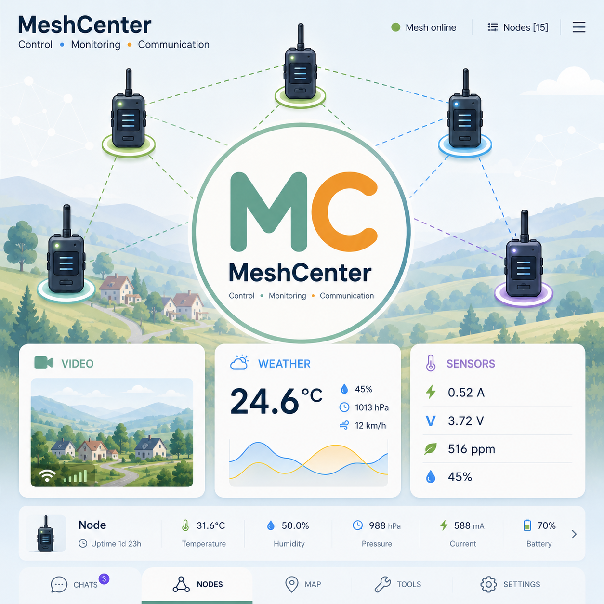
</p>

<p align="center">💬 Messaging · 🗺 Interactive Map · 📊 Telemetry · 📷 Camera</p>

<p align="center">📡 Node Management · ⚙ Raspberry Pi · 🌦 Weather · 📶 Wi-Fi · 🔋 Power Monitoring</p>

<h1 align="center">Meshtastic Powered</h1>

<p align="center">
  
</p>

<p align="center">
  
  
  
  
  
  
</p>

---

## Overview

**MeshCenter** is an open-source browser-based control and monitoring platform for Meshtastic nodes running on Raspberry Pi.

Unlike traditional clients, MeshCenter combines messaging, interactive maps, telemetry, camera support, media management and system monitoring into a single responsive web interface.

## 🌐 Live Demo

Explore MeshCenter in your browser:
https://meshcenter.elektroniker.help/preview/

Instead of depending solely on a mobile application, MeshCenter provides a permanent web interface that is available from any device connected to your local network. It combines messaging (with Meshtastic reply support), an interactive network map, intelligent node management, telemetry dashboards, camera streaming, media management, Wi‑Fi administration, weather information, notifications, system monitoring and documentation into a single lightweight application.

The project is optimized for Raspberry Pi Zero 2W while remaining fully compatible with more powerful Raspberry Pi models.

MeshCenter is designed as a complete control center that continuously runs alongside a Meshtastic node, providing real-time monitoring and convenient management through any modern web browser.

---

## Why MeshCenter?

The official Meshtastic applications are excellent for configuration, mobile operation and everyday communication.

MeshCenter is **not intended to replace them**. It complements the official ecosystem by providing a permanent browser-based control center for fixed stations, gateways and Raspberry Pi based installations.
MeshCenter relies on the official Meshtastic configuration stored on the connected radio. Channel management and radio configuration are performed using the official Meshtastic applications, while MeshCenter automatically detects, synchronizes and works with the configured channels.

Typical use cases include:

- Home base stations
- Portable field communication servers
- Emergency communication nodes
- Raspberry Pi gateways
- Weather monitoring stations
- Remote telemetry systems
- Educational and experimental projects

---

## License

MeshCenter's own code (`server.py`, `api/`, `meshsrv/`, `static/`, `templates/`, and everything else outside `adapters/`) is MIT-licensed — see [LICENSE](LICENSE).

The official [`meshtastic`](https://github.com/meshtastic/python) Python package, used to talk to the radio over serial or Bluetooth, is GPLv3-licensed. To keep GPLv3 code from linking into MeshCenter's own MIT-licensed process, it's isolated in `adapters/meshtastic/` — its own package, its own Python virtual environment (`adapters/meshtastic/venv`), running as a **separate OS process** that Core talks to over a local IPC boundary (newline-delimited JSON over stdin/stdout), never a direct Python import. Core itself never imports `meshtastic`.

`adapters/meshtastic/` ships its own [LICENSE](adapters/meshtastic/LICENSE) (the GPLv3 text). See [THIRD_PARTY_NOTICES.md](THIRD_PARTY_NOTICES.md) for the full dependency breakdown and reasoning.

Process isolation — not which repository the files live in — is the architecture chosen to keep GPLv3 code out of Core's own process; per-directory licensing inside one monorepo is a standard, widely-used pattern, and a separate repository is not necessary for that architecture to work. A separate repository may be split off later purely for distribution convenience, not as a requirement of this design.

For the full technical detail (timeout contracts, subprocess supervision, IPC protocol), see `CLAUDE.md`'s "GPLv3 process isolation" section.

---

## 📸 Screenshots

<details>
<summary>🗺️ Map — Light theme</summary>

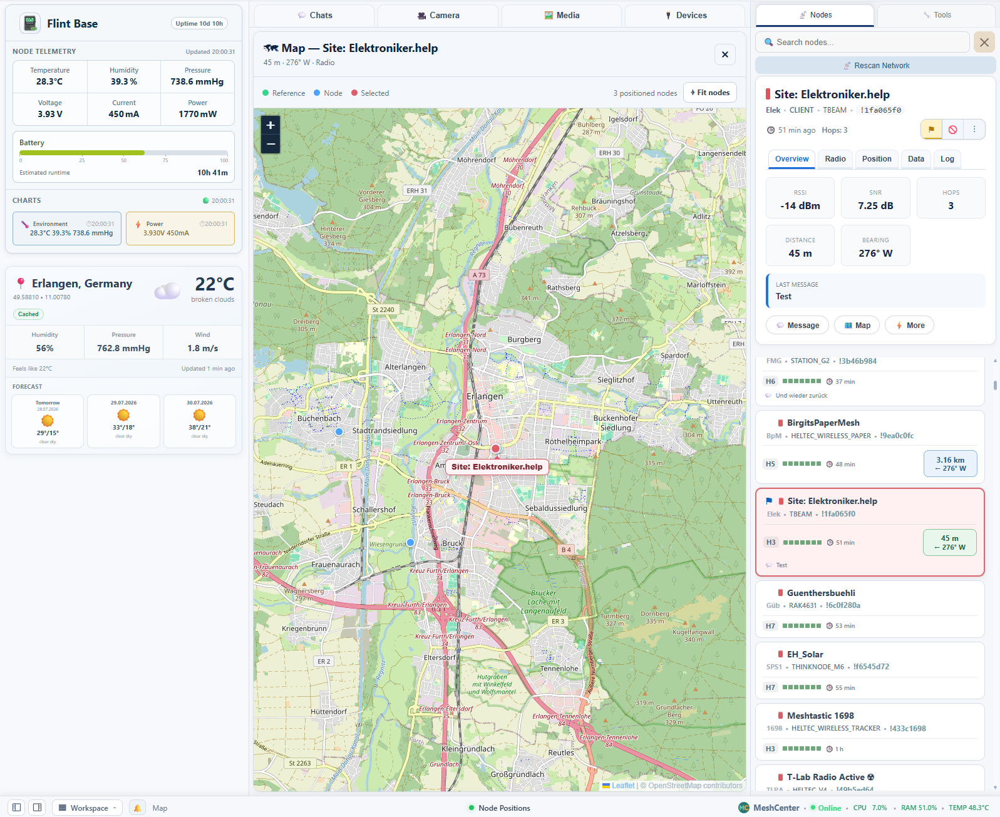

</details>

<details>
<summary>🗺️ Map — Dark theme</summary>

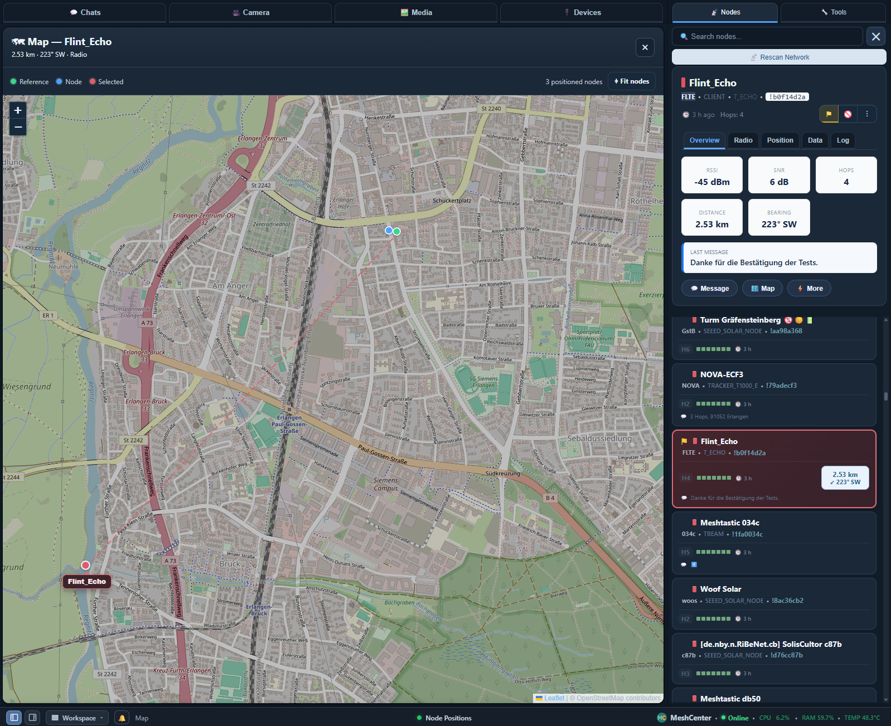

</details>

<details>
<summary>🗺️ Map + Nodes panel — Light theme</summary>

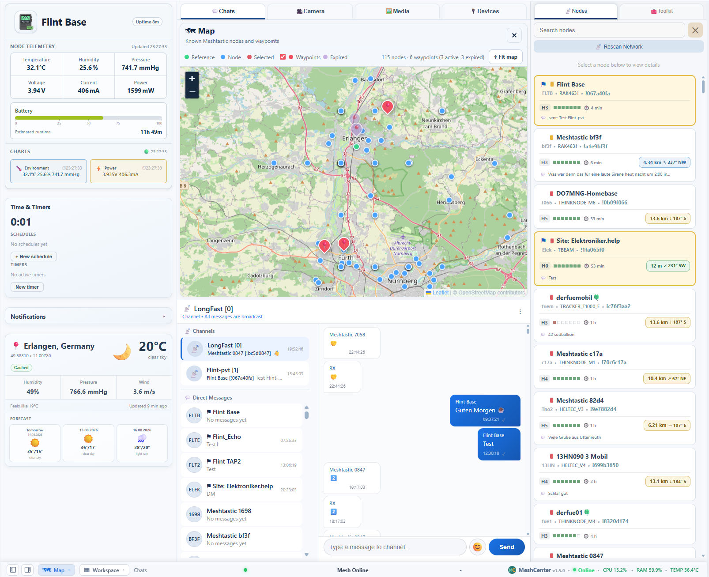

</details>

<details>
<summary>🗺️ Map + Nodes panel — Dark theme</summary>

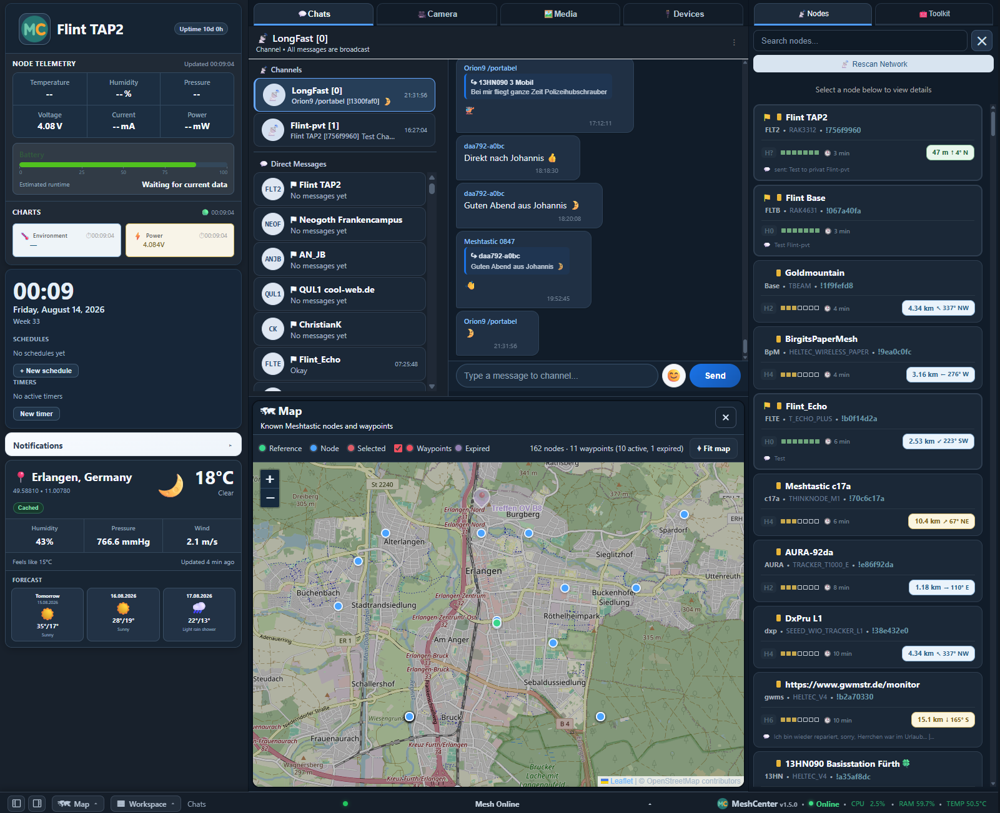

</details>

<details>
<summary>💬 Chats — Light theme</summary>

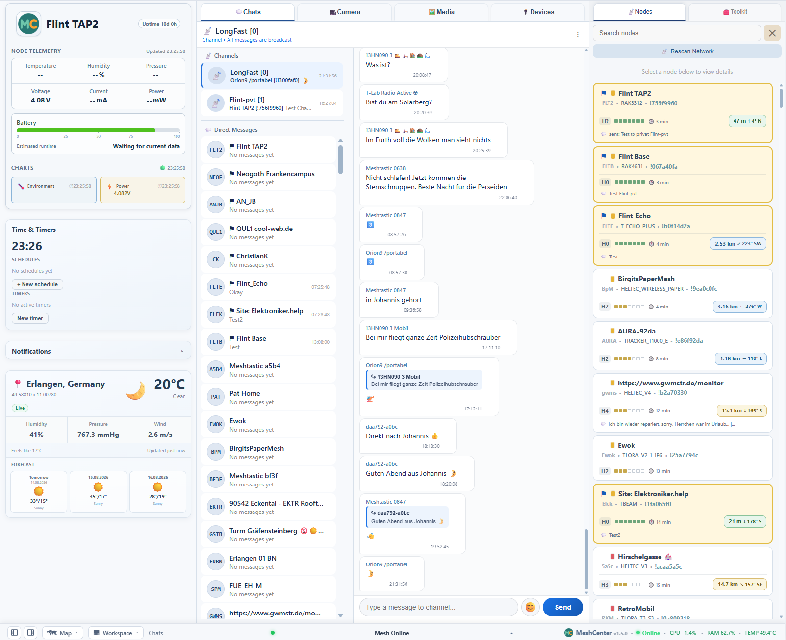

</details>

<details>
<summary>💬 Chats + Nodes panel — Dark theme</summary>

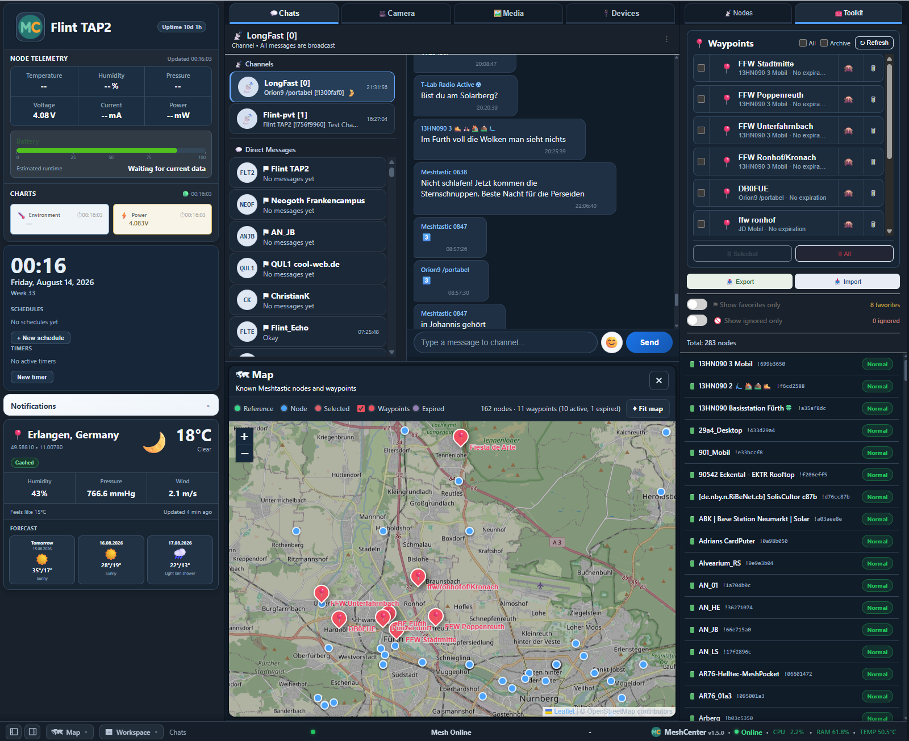

</details>

<details>
<summary>🖼️ Media — Light theme</summary>

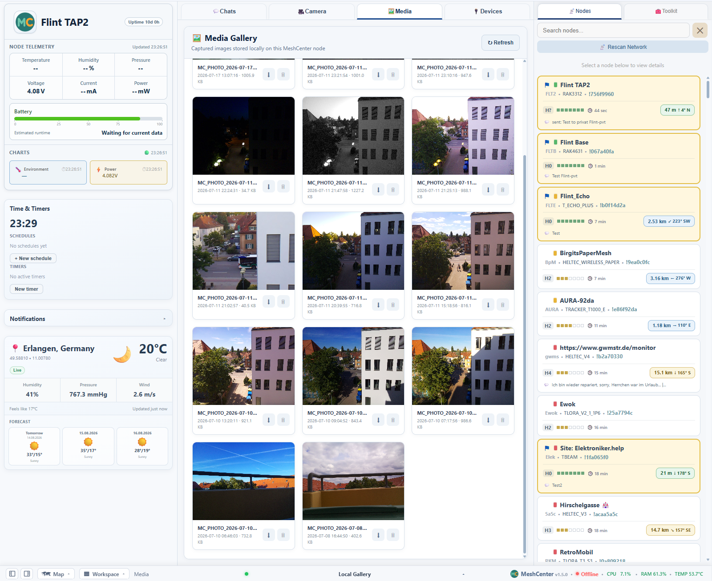

</details>

<details>
<summary>🖼️ Media + Nodes panel — Light theme</summary>

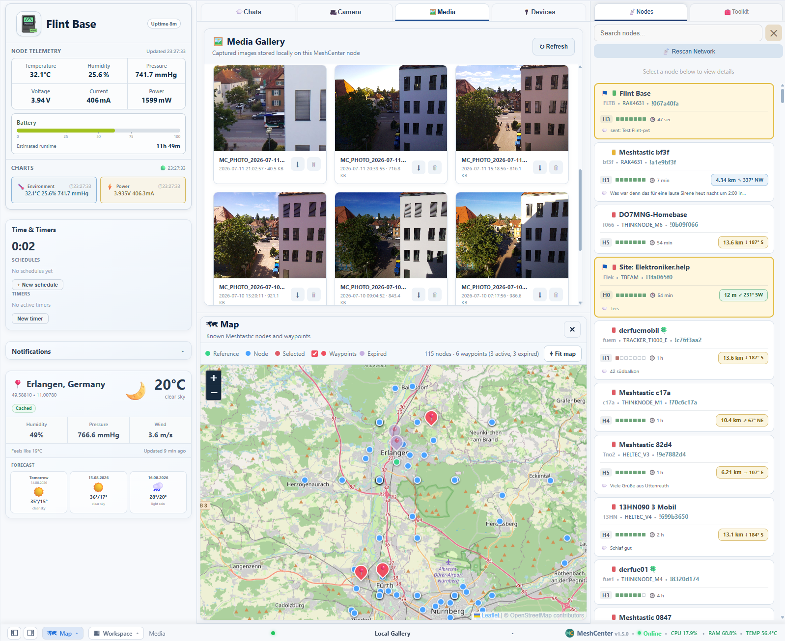

</details>

<details>
<summary>📷 Camera — Light theme</summary>

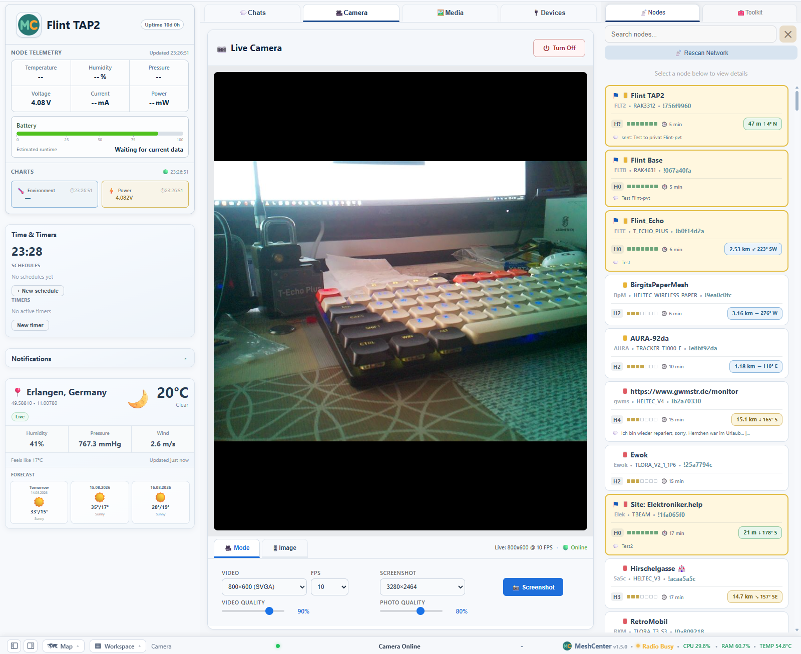

</details>

<details>
<summary>📟 Devices — Light theme</summary>

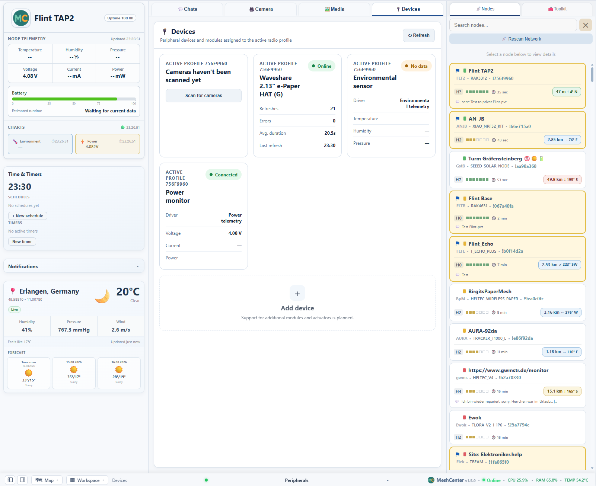

</details>

<details>
<summary>ℹ️ About — Dark theme</summary>

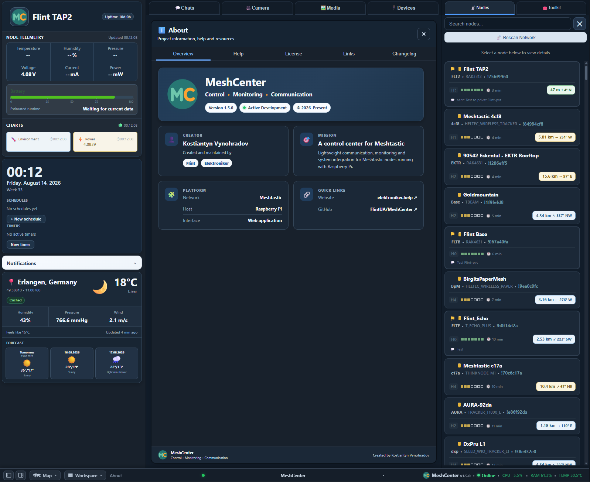

</details>

---

## ⚡ Quick Install

The fastest path is **Automatic Installation**:

1. Flash an SD card with Raspberry Pi Imager (Raspberry Pi OS Lite 64-bit).
2. Copy [`meshcenter-firstboot.sh`](https://github.com/FlintUA/MeshCenter/releases/latest/download/meshcenter-firstboot.sh) to the **root** of the bootfs drive.
3. Open the `user-data` file on the bootfs drive (it already exists after flashing) and add this at the end:
   ```yaml
   runcmd:
     - [ bash, -lc, 'if [ -f /boot/firmware/meshcenter-firstboot.sh ]; then bash /boot/firmware/meshcenter-firstboot.sh; elif [ -f /boot/meshcenter-firstboot.sh ]; then bash /boot/meshcenter-firstboot.sh; fi' ]
   ```
   If `runcmd:` already exists in the file, add only the `- [ bash, ... ]` line under it. **This step is required** — without it the script just sits on the SD card and never runs.
4. Connect your Meshtastic radio via USB **before** first boot.
5. Power on. MeshCenter installs itself unattended (~5-20 min depending on hardware and whether camera support is requested) and is reachable at `http://meshcenter.local:5000` once it reboots.

Prefer to install over SSH on an already-running Pi (or any Debian/Ubuntu
Linux box) instead? That's **Manual Installation** — `curl -sSL
https://raw.githubusercontent.com/FlintUA/MeshCenter/main/install.sh | bash`.

Full step-by-step instructions for both paths, system requirements, and the
serial-access checklist that trips up most first installs: see
**[INSTALL.md](INSTALL.md)**.

---

## ✨ Highlights

***Key Features***

- Browser-based interface
- No additional software required on client devices
- Optimized for desktop web browsers
- Responsive desktop UI
- Open source
- Designed for Raspberry Pi
- Works with standard Meshtastic firmware

### 📚 Documentation

- [Practical User Guide](docs/User_Guide.md)
- [Quick Installation](#installation)
- [Architecture Overview](#application-architecture)
- [Development Roadmap](#roadmap)

## Switching to another Meshtastic radio

1. Open Node Manager.
2. Click Release Radio.
3. Disconnect the current radio.
4. Connect the replacement radio by USB.
5. Wait a few seconds for Linux to create the serial device.
6. Click Detect radio.
7. Confirm the detected radio.
8. For a new radio, MeshCenter creates a clean separate profile.
9. For a known radio, MeshCenter activates its saved profile.
10. MeshCenter restarts automatically.

Each radio profile keeps its own messages, nodes, telemetry, waypoints and icons.
Data from different radios is not merged.

## Connecting via USB or Bluetooth

MeshCenter can talk to your Meshtastic node two ways:

- **USB** (default) — a serial cable to the Raspberry Pi.
- **Bluetooth** — no cable, but see the limitations below before relying on it.

Switch between them in **Settings → Radio Connection → Connection type**. For Bluetooth: click **Scan for devices**, pick your node from the list, then **Connect**.

**Bluetooth is marked "Experimental" in the interface, and here's specifically why:**

- **No incoming messages, telemetry, or node info at all while Bluetooth is active** — not degraded, completely absent. You can send over Bluetooth, but MeshCenter will not receive anything until you switch back to USB.
- **A physical USB cable reconnect (unplug/replug, or a power cycle) needs a full MeshCenter service restart to recover** — not just a click in Settings.
- **Switching between USB and Bluetooth can take up to ~90–135 seconds in the worst case** (measured on real hardware) — it is not a quick toggle.

If you need reliable message reception, stay on USB. Bluetooth is there for cable-free sending scenarios where those limitations are acceptable.

### 💬 Messaging

- MeshCenter automatically detects and synchronizes all channels configured on the connected Meshtastic node. The interface supports Meshtastic channel indexes 0–7, allowing up to eight configured channels, including the primary channel. Channel creation and radio configuration are handled by the official Meshtastic applications.
- Public channel messaging
- Direct messages
- Compatible with the official Meshtastic reply feature.
- Reply composer and quoted replies
- Jump to original message
- Message actions (copy message with sender information)
- Automatic chat updates
- Chat history
- Favorite contacts
- Ignore list
- Message export

### 🧩 Workspace Map

MeshCenter includes a fully integrated interactive map directly inside the workspace.

***Features include:***

- Embedded map without leaving the main interface
- Hide, Split and Full Screen map layouts
- Split layout with top or bottom positioning
- Live node locations
- Quick actions directly from map popups
- Automatic synchronization with node details
- External map provider support when needed

### 📍 Waypoints

MeshCenter includes integrated waypoint management fully compatible with Meshtastic.

Waypoints can be created, stored, managed and transmitted directly from the browser interface without leaving MeshCenter.

- Create and edit waypoints
- Persistent waypoint storage
- Send waypoints to Meshtastic nodes
- Waypoint management workspace
- Local JSON-based storage
- Ready for future waypoint synchronization

### 🗺 Network Visualization

- Display all positioned nodes
- Selected node highlighting
- Node labels
- Node information popups
- Distance and bearing visualization
- Reference location marker
- Fit Nodes view
- Automatic scrolling to selected node
- Persistent node positions

### 📷 Camera & Media Gallery

- Live MJPEG video streaming
- High-resolution photo capture
- Integrated photo gallery with thumbnails, download and delete
- Adjustable image quality and FPS
- Raspberry Pi Camera (CSI) and USB/UVC webcam support, side by side if both are connected
- Media workspace to browse local captures

### 📶 Wi-Fi Manager

- View current Wi‑Fi connection (SSID, signal strength, IP, gateway)
- Scan nearby networks with signal percentage
- Connect to new networks with password prompt
- Automatically reuse saved credentials
- Forget saved profiles

### 📈 Telemetry

- Device telemetry (battery, voltage, channel utilisation, uptime)
- Environmental sensors (temperature, humidity, pressure)
- Power monitoring (voltage, current, power)
- Historical charts with selectable time ranges (1h to 30d)
- Export telemetry data as CSV or JSON

### 🖥 Modern Desktop Interface

- Professional three‑column layout
- Responsive workspace layout
- Workspace panel (show/hide columns, theme, compact mode)
- Notification Center
- Bottom status dock with system metrics
- Improved light and dark themes
- Unified component design
- Custom node icons
- Larger and clearer map markers
- Smoother map interaction

### 📡 Node Management

- Automatic node discovery
- Hardware information and role
- RSSI / SNR monitoring
- Favorites and ignore list
- Import / Export node database (CSV / JSON)
- Merge duplicates
- Synchronized selection with interactive map
- Interactive node popups with quick actions
- Locate nodes directly on the embedded map

### 🛠️ Node Tools

- Request telemetry from any visible node
- Request position (saves coordinates)
- Traceroute – show mesh route to a node

### 🩺 System & Radio Health

- Real‑time system info (hostname, uptime, CPU, RAM, disk, temperature)
- Radio listener status, packet age, telemetry age
- Automatic listener recovery with configurable delay
- CPU usage history chart (30m to 24h)
- System actions: restart MeshCenter, reboot, shutdown

### 🌦️ Weather Module

- Current weather and 3‑day forecast, from a selectable provider (OpenWeather or WeatherAPI)
- Location from manual coordinates or a reference node
- Units follow global preferences
- Auto‑refreshes every 10 minutes

### ⚙️ Web Settings Editor

- Units (temperature and pressure)
- Telemetry update interval
- Battery capacity for runtime estimation
- Listener auto‑recovery settings
- External map service
- Reference location (manual or node‑based)

### 🎨 Workspace & UI Preferences

- Persistent panel visibility, theme and compact mode per browser
- All preferences stored locally

### ⚡ Optimized for Raspberry Pi

MeshCenter has been developed with Raspberry Pi Zero 2W as the primary target platform.

Special attention has been paid to:

- Low memory usage
- Low CPU utilization
- Fast page loading
- Lightweight architecture
- Stable 24/7 operation

### 🧪 Tested Hardware Setup

# IMPORTANT

## Enable Serial Interface on your Meshtastic device

MeshCenter communicates with the radio over the USB serial interface.

Before connecting your Meshtastic node to Raspberry Pi, make sure the serial interface is enabled in the official Meshtastic application.

Without the USB serial interface MeshCenter will not be able to detect or communicate with the radio.

Official Meshtastic App:

Settings → Serial → Enabled

Tested with:

RAK4631
RAK WisMesh TAP v2 (RAK3312)
LilyGO T-Echo Plus

The USB serial interface must be enabled.

MeshCenter is primarily developed and tested on a Raspberry Pi Zero 2 W connected by USB to a standard Meshtastic radio node. The radio uses standard Meshtastic firmware and does not require hardware modification or its own Wi-Fi connection.

The current reference setup includes:

- Raspberry Pi Zero 2 W
- RAK4631-based Meshtastic node connected by USB
- Raspberry Pi Camera via CSI interface
- Supported cameras:
  - IMX219 8 MP (currently installed)
  - OV5647 5 MP (tested)
  - USB/UVC webcam (tested, via `camera_manager`'s shared driver framework - see "Camera" below)
- INA226 power monitor
- BME280 environmental sensor (I2C)
- DS3231 real-time clock (I2C)
- WeAct 1.54" e-Paper display (200×200, black-and-white)

Other Raspberry Pi models and standard Meshtastic-compatible radios with a supported USB serial connection may also work. The radio must first be configured with an official Meshtastic application. MeshCenter then uses the region, channels and channel keys already stored on it.


---

## Design Philosophy

MeshCenter follows a few simple principles:

- Browser-first experience
- Fast and responsive interface
- Reliable long-term operation
- Low resource consumption
- Simple installation
- Easy maintenance
- Full compatibility with the official Meshtastic ecosystem

The goal is to provide a practical and reliable control center that can run continuously on a Raspberry Pi while giving convenient access to the most important functions of a Meshtastic base station from any web browser.

---

## What Makes MeshCenter Different?

Unlike traditional web interfaces, MeshCenter is designed as a complete operational environment for a Meshtastic base station.

It combines multiple independent subsystems into one application:

- Messaging (including Meshtastic reply support)
- Interactive Network Map
- Waypoints
- Camera
- Photo Gallery
- Telemetry
- Node Management
- Node Tools (telemetry request, position request, traceroute)
- System Monitoring & Radio Health
- Weather Integration
- Wi‑Fi Manager
- Local Data Storage
- Background Services
- REST API

This modular architecture makes it easy to extend the project while keeping the user interface simple and responsive.

## Working with Multiple Radios

MeshCenter automatically manages independent profiles for every Meshtastic radio connected to the Raspberry Pi.

Each radio receives its own dedicated profile containing:

- Messages
- Direct messages
- Node database
- Telemetry history
- Waypoints
- Device configuration
- Node icons
- Profile-specific settings

This means you can disconnect one Meshtastic device, connect another one and continue working with its own independent data without affecting the previous radio.

### Connecting a new radio

1. Disconnect the current radio.
2. Connect another supported Meshtastic device via USB.
3. Make sure **USB Serial** is enabled in the Meshtastic firmware.
4. Open **Node Manager**.
5. Press **Detect radio**.

If the radio has never been used before, MeshCenter will offer to create a new clean profile.

If the radio has been used previously, MeshCenter will automatically detect its existing profile and offer to activate it.

No existing profile data is overwritten.

### Switching between radios

After a profile has been created, switching is simple:

1. Open **Node Manager**.
2. Click the desired saved radio.
3. Connect that radio to the Raspberry Pi.
4. Confirm the activation.

MeshCenter will:

- release the current radio;
- verify the newly connected radio;
- activate its saved profile;
- restart the internal listener;
- continue using the selected profile.

The switch normally takes only a few seconds.

### Waypoints

Waypoints belong to the active radio profile.

Each Meshtastic device keeps its own independent waypoint database.

Switching between radios automatically switches to that radio's waypoint collection.

No waypoint data is shared or mixed between different radio profiles.

### Notes

- One USB radio can be active at a time.
- Profiles are never merged automatically.
- Existing data is preserved when switching between radios.
- Profiles can be backed up simply by copying the corresponding folder from `data/profiles/`.

---

## Installation

## ⚠ IMPORTANT: Enable Serial access on the Meshtastic radio

Before connecting a Meshtastic radio to MeshCenter, make sure that
**Serial access is enabled in the Meshtastic settings**.

Open the Meshtastic app and enable:

Settings → Security → Serial enabled

Depending on the app or firmware version, the option may also appear under:

Settings → Device → Serial enabled

Do not confuse this option with the Serial module.

If Serial access is disabled, Linux may still detect the USB device and create
`/dev/ttyACM0`, but MeshCenter and the Meshtastic CLI will not be able to read
the radio identity. Typical symptoms are:

- `Connection timed out`
- `No Meshtastic radio identity could be read`
- `Unable to detect radio`

This is the most common cause of USB detection failure.

### Installation Validation

The installation procedure has been successfully validated on a clean Raspberry Pi Zero 2 W using a **RAK WisMesh TAP v2 (RAK3312)** with standard Meshtastic firmware - installed entirely from the documentation, confirming no undocumented configuration steps are required. Primarily tested on Raspberry Pi Zero 2W; also works on Raspberry Pi 3, 4 and 5.

### Requirements, step-by-step instructions (Automatic or Manual), and troubleshooting

**[INSTALL.md](INSTALL.md) is the canonical installation guide** - hardware/software requirements, the Automatic path (Raspberry Pi Imager + `meshcenter-firstboot.sh`, unattended) and the Manual path (`install.sh` over SSH, or the same steps by hand), plus the sudoers step that's easy to miss and `scripts/verify-install.sh` to check an install automatically.

For first-run checks, interface usage, backup, safe updates and extended troubleshooting after install, see the **[Practical User Guide](docs/User_Guide.md)**, including [Enable System and Wi‑Fi actions](docs/User_Guide.md#enable-system-and-wi-fi-actions) for the sudo rules restart/reboot/Wi‑Fi actions in the UI need.

### Radio Configuration Mode (after install)

MeshCenter normally maintains an active USB connection to the Meshtastic radio in order to provide:

- Real-time messaging
- Node telemetry
- Node management
- Interactive maps
- Node Tools
- Automatic channel synchronization

Since only one application can access the radio at a time, the official Meshtastic mobile application cannot connect while MeshCenter is using the USB interface.

### Temporary Radio Release

To configure the radio using the official Meshtastic Android application:

1. Open **Settings → Meshtastic Radio**.
2. Click **Release Radio**.
3. Wait until the status changes to **Released**.
   - Releasing the USB connection may take up to **1–2 minutes**, depending on the current listener state.
4. Connect to the node using the official Meshtastic Android application via Bluetooth.
5. Make any required changes (channels, encryption keys, LoRa settings, etc.).
6. Disconnect from the Android application.
7. Return to MeshCenter and click **Reconnect Radio**.

MeshCenter automatically reconnects to the radio and resumes normal operation without restarting the service.

### Automatic Synchronization

After reconnecting, MeshCenter automatically:

- Detects newly added channels
- Removes deleted channels
- Updates channel names
- Restores messaging and telemetry
- Resumes node monitoring

No restart or manual refresh is required.

> **Note**
>
> While the radio is released, messaging, telemetry, node management and Node Tools are temporarily unavailable because the radio is intentionally disconnected from MeshCenter.

### Design Philosophy

MeshCenter intentionally does **not** modify the radio configuration itself.

Radio configuration is performed using the official Meshtastic application, while MeshCenter automatically synchronizes with the current radio configuration after reconnecting.

This approach provides several advantages:

- Full compatibility with standard Meshtastic firmware
- No custom firmware required
- Complete compatibility with the official Meshtastic applications
- Safe configuration using the official tools
- Automatic synchronization of channels and radio state

## 🔄 Updating MeshCenter

The easiest way is the **Updates** card in the System workspace (see "System Monitor & Radio Health" above) - it checks for a new release, shows the changelog, and applies it with a safety check plus a one-click restart. The manual steps below remain the fallback for when the web interface itself is unreachable:

```bash
cd ~/meshcenter
git pull
git fetch --tags
sudo systemctl restart meshcenter.service
```

After updating, reload the browser with **Ctrl+F5**.

> **Note:** `git fetch --tags` is required to pull the latest version tag.
> Without it, the version shown in the status bar may remain outdated.
>
> On some installations `sudo systemctl` requires the full path:
> ```bash
> sudo -n /usr/bin/systemctl restart meshcenter.service
> ```

---

## Project Structure

MeshCenter has been designed as a modular application. Each subsystem has its own responsibility, making the project easier to maintain, debug and extend.

A typical installation looks like this:

```
meshcenter/
│
├── adapters/meshtastic/  # GPLv3-isolated Meshtastic transport adapter (own venv, own LICENSE - see "License")
├── api/                # REST API endpoints
├── camera/             # Camera subsystem
├── hardware/           # I2C bus detection, RTC (DS3231) and BME280 drivers
├── meshsrv/            # Core-side radio abstraction: RadioTransport interface, IPC client, router
├── modules/display/    # e-Paper display rendering, pages and drivers
├── storage/            # JSON storage helpers
├── system/             # System/CPU history collection
├── telemetry/          # Telemetry processing
├── weather/            # Pluggable weather provider backend
├── utils/              # Shared utility functions
│
├── static/             # CSS, JavaScript, icons
├── templates/          # HTML templates
├── data/               # Persistent application data (messages, nodes, photos, icons, settings)
├── docs/               # Documentation and images
│   └── User_Guide.md   # Installation and practical operation guide
│
├── venv/               # Core's Python virtual environment (MIT-licensed code only)
│
├── config.py           # Local configuration (not in git)
├── config.example.py   # Example configuration
├── requirements.txt
├── server.py           # Main application entry point
└── README.md
```

The `data` directory stores persistent information such as messages, telemetry history, node icons, camera photos and application settings.

---

## Tech Stack

MeshCenter is built with a lightweight and practical technology stack:

- Python
- Flask
- Gunicorn (production WSGI server)
- HTML5
- CSS3
- JavaScript
- Meshtastic Python API
- Raspberry Pi OS / Linux
- systemd
- Git and GitHub
- Leaflet
- OpenStreetMap

## Core Features

MeshCenter combines several independent subsystems into one control center. Each subsystem is designed to be useful on its own, but together they turn a Raspberry Pi into a practical Meshtastic base station.

### 📚 Documentation

- UI Guidelines
- Components
- Architecture
- Development Roadmap

### 💬 Messaging

MeshCenter provides a browser-based chat interface for Meshtastic communication.

The messaging system supports both public channel messages and direct node-to-node messages.

#### Public Channel

Public messages are sent to the configured Meshtastic channel, usually LongFast channel index 0.

Typical use cases:

- Local mesh chat
- Community messages
- Field communication
- Test messages
- Sensor status announcements

#### Direct Messages

MeshCenter also supports direct messages between nodes.

Direct messages are shown as separate chats, making it easier to work with multiple known nodes from a browser interface.

#### Messaging Features

- Public channel messaging
- Direct node-to-node messaging
- Native Meshtastic reply support
- Reply composer
- Quoted replies
- Jump to original message
- Message actions
- Copy including sender name
- Improved Direct Messages
- Chat history
- Automatic message refresh
- Message timestamps
- Favorite chats
- Ignore list
- Emoji picker
- System messages
- Local JSON-based storage

### 🗺 Interactive Network Map

MeshCenter includes an integrated Leaflet-based interactive map for visualizing the mesh network.

The map is built into the application and can be opened directly from the **Show on map** action. It displays all nodes that have a known position, along with a reference location marker used for distance and bearing calculations.

Node positions are stored locally on the Raspberry Pi and persist across restarts.

### 📍 Waypoints Features

MeshCenter includes integrated waypoint management fully compatible with Meshtastic.

Waypoints can be created, stored, managed and transmitted directly from the browser interface without leaving MeshCenter.

- Create and edit waypoints
- Persistent waypoint storage
- Send waypoints to Meshtastic nodes
- Waypoint management workspace
- Local JSON-based storage
- Ready for future waypoint synchronization

#### Map Features

- Integrated Leaflet-based map inside MeshCenter
- Open map directly from **Show on map**
- Display all positioned nodes
- Reference location marker
- Selected node highlighting
- Node labels
- Node information popups
- Distance and bearing visualization
- Fit Nodes view
- Synchronized node selection between map and node list
- Automatic scrolling to selected node
- Persistent node positions

#### Map UI and Performance

- Redesigned map panel
- Larger and clearer map markers
- Better popup positioning
- Improved selection colors and node highlighting
- Smoother map interaction
- Faster map updates and reduced unnecessary redraws
- Optimized map refresh logic and node synchronization

Node selection is synchronized between the map and the node list: selecting a node on the map highlights it in the list (and scrolls to it), and selecting a node in the list highlights it on the map.

> **Note:** The integrated map uses Leaflet with OpenStreetMap tiles. The separate **Map provider** setting (OpenStreetMap / Google Maps) controls only external “open in maps” links for individual node positions, not the built-in map.

### 🖥 Modern Desktop Interface

- Professional three-column layout
- Redesigned map panel
- Workspace panel
- Notification Center
- Bottom status dock
- Improved light and dark themes
- Better spacing and layout consistency
- Unified component design
- Custom node icons
- Responsive dashboard

### 📡 Node Management

MeshCenter automatically discovers nodes from the Meshtastic mesh and stores them locally.

The node list helps you understand what devices are visible in your area and when they were last heard.

#### Node Information

Depending on the available data, MeshCenter can display:

- Long name
- Short name
- Node ID
- Hardware model
- Role
- Last seen time
- RSSI
- SNR
- Hop distance
- Last message

#### Favorites

Frequently used nodes can be marked as favorites.

Favorites are useful for:

- Your own devices
- Family nodes
- Field team nodes
- Known repeaters
- Important contacts

#### Ignore List

Nodes that are not relevant can be ignored.

Ignored nodes remain in the database, but they can be hidden from the main view and filtered out from normal interaction.

This is useful in busy areas where many nodes are visible but only a few are important for your setup.

#### Import and Export

MeshCenter supports importing and exporting the local node database in CSV and JSON formats.

This is useful for:

- Backups
- Moving to another Raspberry Pi
- Keeping a known node list
- Sharing node information between installations

### 🛠️ Node Tools (Remote Commands)

MeshCenter can send commands to any visible node directly from the web interface:

- **Request Telemetry** – Ask the node to send its current sensor readings (temperature, humidity, pressure, voltage, current, power)
- **Request Position** – Request the node's GPS or fixed position; the result is saved and displayed
- **Traceroute** – Show the mesh route to the destination node, both forward and return paths

These tools are available from the node detail card and the Node Tools button.

### Custom Node Icons

You can upload a custom image (PNG, JPEG or WebP) for any node (including the local base node). The image is automatically centered and cropped into a 256×256 transparent square. Icons are stored locally on the Raspberry Pi and are served by MeshCenter.

## 🔔 Notifications

MeshCenter includes a notification system that helps operators stay informed without constantly watching the active chat.

Features include:

- Channel activity notifications
- Unread message indicators
- Conversation highlighting
- Improved notification synchronization
- Optional browser (OS-level) notification popups for timers, schedules and new messages — see "Notification Center" below

### 📈 Telemetry

MeshCenter displays telemetry received from Meshtastic devices and stores historical telemetry locally.

Telemetry is useful for monitoring both the radio node and connected sensors.

#### Device Telemetry

Supported device telemetry includes:

- Battery level
- Voltage
- Channel utilization
- Air utilization
- Uptime
- Last update time

#### Environmental Telemetry

Environmental telemetry can include:

- Temperature
- Humidity
- Atmospheric pressure

Typical sensor: **BME280**

#### Power Monitoring

Power telemetry can include:

- Voltage
- Current
- Power

Typical sensor: **INA226**

#### Telemetry History

Telemetry history is stored locally and can be displayed as charts with selectable time ranges (1 hour to 30 days). Data can be exported as CSV or JSON.

### 📷 Camera

MeshCenter includes camera support based on Raspberry Pi Camera (CSI, via Picamera2) and USB/UVC webcams — both are handled through a shared driver framework (`camera_manager`), so `/video_feed`, live preview and photo capture work the same way regardless of which camera is active.

The camera subsystem is designed for lightweight live viewing and photo capture on low-power hardware.

#### Multiple Cameras

If more than one camera is detected (e.g. a CSI camera and a USB webcam plugged in at the same time), the `Devices` tab lists each one as its own card with live status, and the `Camera` tab's source selector lets you switch which one is currently active without restarting MeshCenter. Duplicate detection avoids listing the same physical camera twice when it happens to be reachable through both a CSI and USB code path.

#### Live Video

Live video is provided as an MJPEG stream.

MJPEG is not the most bandwidth-efficient video format, but it has excellent browser compatibility and works reliably without additional client-side software.

#### Photo Capture

MeshCenter can capture high-resolution photos and store them locally.

The application can use different settings for:

- Live preview
- Video mode
- Photo capture

This allows the system to keep the live view lightweight while still supporting full-resolution image capture.

#### Camera Settings

Depending on the connected camera, MeshCenter can support:

- Video resolution
- Photo resolution
- FPS
- JPEG quality
- Preview size
- Save size

#### Gallery

Captured images are saved locally and can be viewed through the Media workspace. The gallery displays thumbnails, file size, capture time and provides download and delete actions.

### 🖼️ Media Gallery

MeshCenter stores captured photos inside the local data directory.

The gallery provides browser-based access to saved images without requiring SSH or file browser access to the Raspberry Pi.

Typical use cases:

- Checking recent camera captures
- Reviewing field images
- Downloading saved photos
- Keeping a visual project log

The gallery shows total image count, used space and free space. You can delete individual images or clear the entire gallery.

**Note:** The term “screenshots” in the storage directory and some internal references refers to photos captured by the Raspberry Pi Camera. The interface screenshots shown in this README are illustrative images of the web UI and are not stored by the application.

Photos are stored locally and are **not** transmitted through Meshtastic.

### ⚙️ Local Storage

MeshCenter stores application data locally using JSON files (see "Data Storage" below for the full list of stored files).

This keeps the project simple and easy to inspect, backup and repair.

Local storage is useful because:

- No external database is required
- Backups are easy
- Files can be inspected manually
- The system remains lightweight
- The installation stays simple

### 🩺 System Monitor & Radio Health

MeshCenter provides a dedicated System workspace that gives you full visibility into your Raspberry Pi and Meshtastic radio status.

#### System Information

- Hostname, uptime, CPU load and temperature
- RAM usage (used / total)
- Disk usage (used / total)
- Raspberry Pi model and OS version

#### Radio Health Dashboard

- Listener status (running / stopped / paused)
- Packet age, telemetry age and send age
- Status level (OK, Warning, Error)
- Restart count and fail count
- A recommendation message for troubleshooting

#### CPU History Chart

- Live CPU usage graph with selectable ranges: 30m, 1h, 6h, 12h, 24h
- Current CPU usage, RAM usage and temperature are also shown in the status dock
- An on-demand, collapsible **Top Processes** panel underneath shows the 5 highest CPU consumers system-wide (not just MeshCenter) — queried only when opened, with no background polling while collapsed

#### System Log

- A detailed event log showing listener starts, stops, errors and system actions
- Logs are stored persistently and can be viewed directly in the System workspace

#### Automatic Listener Recovery

- If the Meshtastic listener stops, MeshCenter can automatically restart it after a configurable delay (30–300 seconds)
- The recovery mechanism respects a safety limit (max 3 attempts in 30 minutes) to avoid restart loops

#### Updates

An **Updates** card checks GitHub Releases for a newer version - a background check (daily by default, togglable in Settings) caches the result server-side, so the browser never calls the GitHub API directly and multiple open tabs never multiply the request rate. The card shows the current and latest version plus the real release changelog, with two actions:

- **Check now** - an on-demand refresh of the cached release info.
- **Update** - runs a safety preflight first (clean working tree, a real upstream, no diverged or ahead local history) and shows an honest error naming the exact problem if it isn't safe, rather than trying to resolve it automatically. Only if the preflight passes does it ask for confirmation, then applies the update with a plain fast-forward merge and restarts the service.

After restarting, the interface polls for the service to come back with the expected version and reports success once confirmed. If it doesn't come back within 60 seconds, it shows the pre-update commit and a ready-to-copy rollback command instead of waiting indefinitely - there is no automatic rollback, by design (a same-process update can't reliably fix itself if the new code fails to start).

### 🔌 I2C Devices & Real-Time Clock

MeshCenter can detect and configure host-attached I2C peripherals directly from the **Devices** tab, without needing to SSH into the Raspberry Pi.

- **I2C bus detection** - a read-only scan (`i2cdetect`) reports which addresses respond on the bus, with a clear explanation if the bus isn't enabled yet or the `i2c-dev` kernel module hasn't loaded.
- **Guided setup** - an "Enable I2C & configure RTC" action in the device card runs a narrowly-scoped privileged helper (`meshcenter-hw-config`, invoked through a dedicated sudoers rule) that enables the I2C interface and adds the Device Tree overlay for the RTC, without granting the app broad root access.
- **Real-Time Clock (DS3231)** - status is reported in three independent stages rather than a single Online/Offline flag: **detected** (the RTC answers on the I2C bus), **configured** (the kernel has bound the overlay, so `/dev/rtc0` exists - takes effect after a reboot), and **readable** (`hwclock -r` can actually read the time off the device). Each stage surfaces its own reason when it fails, so a stuck setup is easy to diagnose instead of just showing "not working."
- **BME280 environmental sensor** - a second I2C device type (temperature/pressure/humidity), added on top of the same generic bus-detection and device-card framework used for the RTC, without changes to the underlying architecture.
- **Time Service integration** - the "Time & Timers" card shows the real active time source (NTP, hardware RTC, or system clock, in that order of preference), reflecting whether a configured RTC is actually being used.

### 🖥️ e-Paper Display

MeshCenter can drive an optional e-Paper HAT to show live status directly on the hardware, without needing a browser open - useful for a headless base-station deployment. Two panels are supported: the Waveshare 2.13" 4-color HAT and the WeAct 1.54" black-and-white module, selectable in **Settings → Hardware → e-Paper Display**.

- **Five info screens plus an alert screen** - Status, Radio, Power, System and Message, each redesigned around the physical panel's resolution, plus a dedicated full-screen Alert view for critical conditions (radio offline, critically low power) that bypasses the normal update debounce.
- **Automatic page rotation** - cycles through a configurable set of screens on a configurable interval; a critical alert interrupts rotation immediately and rotation resumes afterward, and manually requesting a specific screen from the UI ("Show on Display") always takes priority.
- **Live clock overlay** - the current time is shown on every info screen without triggering a real panel refresh on every tick, keeping wear on the physical display to actual content changes.
- **Node name header** - shown in its own original case (not forced uppercase) and automatically wraps to two lines when a long node name (e.g. one with a region/route prefix) wouldn't otherwise fit, instead of being clipped or overflowing the screen edge.

### 🌦️ Weather Module

MeshCenter shows current weather conditions and a 3‑day forecast for your location, sourced from a pluggable weather provider (`weather/providers/`) - currently OpenWeather or WeatherAPI. The active provider is chosen in **Settings → Weather Provider**.

- **Server-side API key** - Each provider's API key is stored in the local `weather_secrets.py` file and never exposed to the browser
- **Caching** – Weather data is cached for 10 minutes to reduce API calls
- **Location sources**:
  - Manual coordinates (set in the web Settings)
  - Reference node position (if the node has GPS)
  - Static configured coordinates (fallback from `config.py`)
- **Units** – Follow global unit preferences (temperature, pressure, wind speed)
- **Forecast** – Shows the next three days with temperature ranges, weather condition and precipitation probability
- **Refresh** – Click the status badge to force an immediate update

The weather card is displayed in the Base panel and updates automatically every 10 minutes.

### 🎨 Workspace & UI Preferences

MeshCenter remembers your interface preferences per browser using local storage.

- **Panel visibility** – Show or hide the Base and Nodes panels
- **Theme** – System (follows OS), Light or Dark
- **Compact mode** – Reduced spacing and control sizes for smaller screens

All changes are saved automatically and applied on next visit.

Access the Workspace menu from the bottom‑left status dock.

### ⚙️ Web Settings Editor

MeshCenter provides a graphical settings interface accessible from the Workspace menu.

You can adjust the following without editing configuration files:

- **Units** - Temperature (°C/°F) and pressure (hPa/mmHg)
- **Telemetry interval** – How often sensor readings are stored (2, 5, 10, 15, 30 minutes)
- **Battery capacity** – Used for runtime estimation (100–50000 mAh)
- **Listener auto‑recovery** – Enable/disable, delay (30–300 seconds)
- **Map provider** – OpenStreetMap or Google Maps for external node-position links (does not affect the integrated Leaflet map)
- **Reference location** – Set a manual coordinate or select a node as the reference for distance/bearing calculations on the map

All settings are saved immediately and persist across restarts.

### 🌍 Localization (i18n)

MeshCenter includes the underlying infrastructure for a multi-language interface, selectable from **Settings → General → Language**.

**What works today:**

- Language switching (Auto / English / Deutsch / Русский / Українська) from the Settings panel
- The page's `<html lang>` attribute and the loaded translation catalog follow the selected language (or the browser's language when set to Auto)
- Part of the static interface text, a first slice of error and toast messages, and the Weather module's response language (mapped to whichever provider is active) all follow the selected language
- Verified end-to-end for all four locales (en/de/ru/uk)

**What's not translated yet:**

The German, Russian and Ukrainian catalogs currently contain the same English text as placeholders — the translation *infrastructure* is complete and tested, but the actual translated wording has not been written yet. Selecting German or Ukrainian today changes the mechanism (`<html lang>`, weather text, the wired error messages) while most of the visible interface text still reads in English until real translations are added in a future update.

Most of the chat interface (message bubbles, toasts and dialogs generated dynamically by JavaScript) is not yet wired into the translation system at all and remains English-only regardless of the selected language.

See `static/i18n/README.md` for translator notes, including terms that must never be translated (Meshtastic, LongFast, PSK, and similar).

### 🧩 Modular Architecture

MeshCenter is gradually moving from a single large server file to a modular architecture (see "Project Structure" above for the current module list).

This makes the project easier to maintain and extend.

The goal is to keep `server.py` as the central coordinator while moving specialized logic into dedicated modules.

## 🕐 Time System, Notifications & Automation

### 🕐 Time System

MeshCenter now maintains a single, authoritative source of time based on the Raspberry Pi. Every connected client (desktop browser, tablet, phone) sees the same device time instead of its own local browser clock.

- **"Time & Timers" card** – shows the current MeshCenter time, its timezone, and sync status
- **12h / 24h format** – switchable in Settings → Units, applied globally to every timestamp in the interface
- **Automatic time-source detection** – NTP (`systemd-timesyncd`), hardware RTC, or the system clock, in that order of preference
- **Meshtastic node time sync** – MeshCenter automatically sets the exact time on the connected radio node via the `setTime()` API on (re)connect
- **e-Paper display integration** – the current time is shown on all info screens of both supported displays (Waveshare 2.13" 4-color and WeAct 1.54"), without increasing the physical refresh rate

### 🔔 Notification Center

A new **"Notifications"** card sits between the Time card and the Weather card.

- Persistent event history – stays visible when you come back to the screen
- Unread-count badge in the card header
- Notifications from every source in one place: schedules, timers, system events
- Each notification can be dismissed individually, or cleared all at once
- Works alongside the existing toast popup system: toasts are for an immediate heads-up, the card is for history
- **Browser notifications** (opt-in, Settings → Browser Notifications) — duplicates selected event categories (timer finished, schedule triggered, new channel message, new direct message) into a real OS-level notification popup, useful when the tab is in the background. Suppressed while the tab is visibly focused. Requires the page to be served over a secure context (HTTPS or `localhost`) — plain-HTTP LAN access, MeshCenter's default, needs a one-time browser flag override for testing (see the User Guide) until/unless HTTPS is set up

### 📅 Schedule Engine

A scheduling system that runs actions automatically, on a time basis.

**Two trigger modes:**
- **At a specific time** – a fixed hour/minute, with day-of-week selection
- **Every N minutes** – a fixed interval, independent of time of day

**Three action types:**
- 📋 **System Log entry** – a quiet log record, no other side effects
- 📩 **Send a mesh message** – a static text message to a specific node or channel
- 📊 **Send a data report** – an automatic report built from current telemetry (voltage, temperature, humidity, pressure, battery, weather), with field selection, a compact/line-by-line format, and a stale-data policy

**Notifications on fire:**
- A short **signal** (up to 95 characters) sent over Meshtastic to a node or channel
- **Details** – the full text or task list, shown in the notification card and the System Log

Schedules persist across service restarts. If MeshCenter doesn't have a trusted, synchronized time, schedules do not run – to avoid firing on a wrong clock.

### ⏱ Timers

Two modes:

- **Stopwatch** – counts up from the moment it's started
- **Countdown** – a timer for a fixed duration (HH:MM:SS); on reaching zero it automatically creates a notification and, optionally, sends a signal over Meshtastic

Timers can be **paused and resumed** without losing elapsed time — the running count freezes on pause and continues from exactly where it left off on resume, across as many pause/resume cycles as needed. Stop remains a separate, terminal action (only Reset can restart a stopped timer from zero).

Timers are in-memory (reset on service restart). On restart, a notification is recorded in the notification card for each timer that was reset this way.

### ⚙️ Under the hood

- **Centralized time formatter** (`TimeFormatter`) – a single formatting point for the whole interface, aware of the active UI language and the 12h/24h setting
- **i18n consistency check script** (`scripts/check-i18n.py`) – automatically verifies the EN/DE/RU/UK translation catalogs stay in sync
- **Form preference persistence** – selected channel/node and checkbox state in composer-style forms (Schedule, Timer) are saved server-side, scoped to the active radio profile

These new features (Time System, Notification Center, Schedule Engine, Timers) are fully translated for all four supported interface languages (English, Deutsch, Русский, Українська) – unlike some older parts of the interface noted in the Localization (i18n) section above.

## ⚙ Action Engine

MeshCenter now includes an internal Action Engine responsible for processing interactive operations between the user interface and backend services.

The Action Engine provides:

- Centralized action handling
- Extensible architecture
- Better separation between UI and backend
- Foundation for future automation features

## 🆔 Runtime Identity

MeshCenter automatically detects the connected local Meshtastic node and maintains a runtime identity.

This improves:

- Local node detection
- Backend synchronization
- Message handling
- Future multi-node support

---

## Camera Notes

Camera support depends on Raspberry Pi system packages.

The recommended way to create the virtual environment (with `--system-site-packages`) is already described in the installation section. Without this option, Python inside the virtual environment may not see system packages such as:

- Picamera2
- Pillow (system version)
- libcamera-related bindings

To test camera imports:

```bash
source venv/bin/activate
python - <<'PY'
try:
    from picamera2 import Picamera2
    print("Picamera2 OK")
except Exception as e:
    print("Picamera2 ERROR:", e)

try:
    from PIL import Image
    print("Pillow OK")
except Exception as e:
    print("Pillow ERROR:", e)
PY
```

### Recommended Camera Settings

For Raspberry Pi Zero 2W, conservative camera settings are recommended.

| Setting            | Recommended          |
|--------------------|----------------------|
| Video Resolution   | 640 × 480 or 800 × 600 |
| FPS                | 8–15                 |
| JPEG Quality       | 70–85                |
| Photo Preview      | 640 × 480            |
| Photo Capture      | 3280 × 2464          |

Higher settings may work, but they increase CPU usage, memory usage and heat.

### Recommended Raspberry Pi Zero 2W Usage

Raspberry Pi Zero 2W is powerful enough for MeshCenter, but it has limited resources.

For best stability:

- Avoid unnecessarily high video FPS
- Avoid very high JPEG quality for live video
- Keep browser polling intervals reasonable
- Use a reliable power supply
- Use a good microSD card
- Keep the enclosure ventilated
- Monitor CPU temperature during long camera sessions

MeshCenter is designed to remain lightweight, but camera streaming and photo capture can still temporarily increase system load.

---

## Application Architecture

MeshCenter consists of several independent modules that work together.

```
                    Web Browser
                          │
                          │ HTTP
                          ▼
                   Flask Application
                          │
     ┌──────────────┬──────────────┬──────────────┬──────────────┐
     │              │              │              │              │
     ▼              ▼              ▼              ▼              ▼
 Messaging      Camera        Telemetry      System/Health   REST API
     │              │              │              │
     └──────────────┼──────────────┴──────────────┘
                    ▼
             Meshtastic CLI
                    │
                    ▼
             LoRa Radio Device
```

The browser never communicates directly with the Meshtastic node. All communication is handled by the Flask application, which coordinates the different subsystems.

"Meshtastic CLI" above is a simplification: reads (the long-lived listener, plus one-off `--info` calls) go through the official Meshtastic CLI, but sends go directly through the Meshtastic Python SDK's `SerialInterface`, not the CLI - both paths share the same USB serial connection, coordinated so they never run concurrently.

In production, requests reach the Flask application through [Gunicorn](https://gunicorn.org/) (see `gunicorn.conf.py` / `wsgi.py`), not shown separately above to keep the diagram focused on MeshCenter's own subsystems.

---

## Data Storage

MeshCenter intentionally avoids an SQL database for almost everything.

Nearly all application data is stored as JSON files. Waypoints are the one
exception: they're stored in a per-profile SQLite database
(`waypoints.db`), since querying/filtering a growing waypoint set fits a
real database better than a flat JSON file - everything else stays JSON.

**Advantages of the JSON-first approach:**

- No database server required
- Easy backups
- Human-readable files
- Simple migration between Raspberry Pi devices
- Easy recovery after unexpected shutdowns

Typical stored files include:

```
messages.json
nodes.json
chats.json
telemetry_history.json
deleted_dm.json
sensors.json
settings.json
camera_config.json
auth.json           # created on first start (fresh installs) or once you turn protection on (existing installs)
waypoints.db
node_icons/
screenshots/
```

---

## REST API

MeshCenter exposes a REST API used by the browser interface.

Examples of available endpoints include:

```
GET    /api/chats
GET    /api/messages
POST   /api/send

GET    /api/telemetry
GET    /api/telemetry/history
POST   /api/telemetry/config

GET    /api/sensors
GET    /api/base_status
GET    /api/radio_health

GET    /api/system/info
GET    /api/system/network
GET    /api/system/cpu-history
GET    /api/system/top-processes
POST   /api/system/action

GET    /api/nodes
GET    /api/nodes_management
POST   /api/nodes_import
GET    /api/nodes_export

POST   /api/node_tools

GET    /api/camera/status
POST   /api/camera/settings
POST   /api/photo/capture
POST   /api/photo/save

GET    /api/waypoints
POST   /api/waypoints/send
DELETE /api/waypoints/<id>

GET    /api/hardware/i2c
POST   /api/hardware/i2c/scan
GET    /api/hardware/rtc
POST   /api/hardware/rtc/configure
GET    /api/hardware/bme280
GET    /api/hardware/display
POST   /api/hardware/display/show/<page>

GET    /api/timers
POST   /api/timers
PATCH  /api/timers/<id>/pause
PATCH  /api/timers/<id>/resume
PATCH  /api/timers/<id>/stop
PATCH  /api/timers/<id>/reset

GET    /api/updates/status
POST   /api/updates/check
GET    /api/updates/preflight
POST   /api/updates/apply

GET    /api/weather/current

GET    /api/security
POST   /api/security
GET    /login
POST   /login
POST   /api/logout
```

The API is primarily intended for the built-in web interface, but it also allows future integrations with third-party applications.

---

## Performance

MeshCenter has been optimized for Raspberry Pi Zero 2W.

Typical resource usage depends on the enabled features. Approximate values measured on a Raspberry Pi Zero 2W:

| Feature             | CPU (approx.)      | RAM (approx.) |
|---------------------|--------------------|---------------|
| Idle                | < 5 %              | 40–60 MB      |
| Messaging           | 5–15 %             | 50–80 MB      |
| Telemetry           | 5–10 %             | 50–70 MB      |
| Camera Preview      | 25–50 %            | 80–120 MB     |
| Photo Capture       | short peak 60–90 % | 90–130 MB     |
| System Monitoring   | 5–10 %             | 50–70 MB      |

Live MJPEG streaming is currently the most resource-intensive component. Values can vary depending on resolution, FPS, JPEG quality and the number of connected browser clients.

---

## Security

MeshCenter is intended for trusted local networks.

Current security model:

- Local network access
- No cloud dependency
- No external database
- Local JSON storage
- Local camera storage

If remote access is required, it is recommended to use a VPN or another secure tunnel instead of exposing the web interface directly to the Internet.

### Optional password protection

MeshCenter can be protected with a single shared password - **Settings → Security**. It's a single on/off switch, not a multi-user system: one password guards the entire application (every API route, including `restart`/`reboot`/`shutdown` and Wi‑Fi management), not individual users or features.

- **On by default for fresh installs.** The first time MeshCenter starts with no `data/auth.json` yet, it generates a random password, prints it once to the console/log, and saves it to `data/initial_password.txt` (readable only by the service's own user). Log in with it, then change it via **Settings → Security**.
  - **Existing installs are not affected.** `config.py` is a local, gitignored file - `git pull`/updating never touches it, and every existing install already has `AUTH_ENABLED = False` written into its own `config.py` from whenever it was installed. Nothing changes on an existing install unless you edit `config.py` yourself.
  - Set `AUTH_ENABLED = False` in `config.py` to opt out of protection (and generation) entirely, same as before.
  - **Forgot the generated password?** SSH in and either read `data/initial_password.txt` if it's still there, or remove `data/auth.json` and restart the service (`sudo systemctl restart meshcenter.service`) - protection turns back off (the same "empty hash never locks you out" rule below), log in and set a new password via Settings → Security.
  - **Regenerating `config.py` from a fresh `config.example.py`** (e.g. comparing against upstream, or a from-scratch reinstall that leaves `data/` behind) will pick up `AUTH_ENABLED = True` again. If `data/auth.json` isn't present at that point, MeshCenter generates a new password the next time it starts, even if you didn't expect a "fresh install" experience - check `data/initial_password.txt`/the log if the app unexpectedly asks you to log in after such a change.
- When enabled, an unauthenticated browser is redirected to a login page (`/login`); unauthenticated API requests get `401`. Static assets and the login page itself stay reachable so the login form can render.
- The password is hashed (`werkzeug.security`, never stored in plain text) in `data/auth.json`, not in `config.py` or `settings.json` - it isn't wiped by an unrelated settings save and never comes back in a settings API response. `config.py`'s `AUTH_PASSWORD_HASH` is only ever consulted the first time (to seed `auth.json`, or to generate a password when it's left empty) - once `auth.json` exists, `config.py`'s two auth variables are ignored on every later restart.
- This is one shared secret for the whole app, not per-user accounts - it doesn't replace a VPN for remote access, it's meant to reduce exposure on a shared or guest local network.

---

## Major Features

- **Interactive Network Map** – Integrated Leaflet-based map with positioned nodes, reference marker, distance/bearing, synchronized selection with the node list, persistent positions, Fit Nodes view and node information popups
- **Messaging Improvements** – Native Meshtastic reply support, reply composer, quoted replies, jump to original message, message actions and improved Direct Messages
- **Map UI & Performance** – Redesigned map panel, larger markers, smoother interaction, faster updates, reduced redraws and optimized refresh logic
- **System & Radio Health** – Added system monitoring, radio health dashboard, CPU history chart and automatic listener recovery
- **Weather Module** – Pluggable weather provider (OpenWeather or WeatherAPI, selectable in Settings) with caching and location from reference node
- **Node Tools** – Added remote telemetry, position request and traceroute
- **Custom Node Icons** – Upload and manage icons for any node
- **Workspace & UI** – Persistent panel visibility, theme, compact mode; improved light/dark themes and layout consistency
- **Web Settings Editor** – Units, telemetry interval, battery capacity, listener recovery, external map-link provider, reference location
- **Media Gallery** – Thumbnails, download, delete, storage info
- **Export/Import** – Node database export/import in CSV and JSON
- **Wi‑Fi Manager** – Scan, connect, forget with saved networks indicator

---

## Known Limitations

| # | Description | Status |
|---|---|---|
| KI-001 | The e-Paper driver could hang on start with the Waveshare 2.13" color HAT | Resolved |
| KI-002 | The Meshtastic Python API (2.7.x) does not support reading a node's current time | Waiting on upstream |
| KI-003 | The field picker UI for the "Send data report" schedule action is still basic | Planned |
| KI-007 | Chat-list timestamps are formatted server-side and don't react to the 12h/24h toggle | Planned |

Full history and root-cause details for these and other known issues: see [KNOWN_ISSUES.md](KNOWN_ISSUES.md).

## Troubleshooting

### Meshtastic CLI not found

The `meshtastic` package lives in its own venv, separate from Core's
(see CLAUDE.md's "process isolation" section) — check it's installed
there:

```bash
which adapters/meshtastic/venv/bin/meshtastic
```

If missing, provision it: `python3 -m venv adapters/meshtastic/venv &&
adapters/meshtastic/venv/bin/pip install -r adapters/meshtastic/requirements.txt`
(see INSTALL.md step 3b). Verify the configured path in `config.py` if
you're pointing at a custom location.

### Radio not detected

Verify that the device is connected:

```bash
ls /dev/ttyACM*
```

Test communication:

```bash
adapters/meshtastic/venv/bin/meshtastic --info
```

### Camera not working

**CSI camera (Picamera2):** verify that Picamera2 is available:

```bash
source venv/bin/activate
python -c "from picamera2 import Picamera2"
```

If the import fails, recreate the virtual environment with system site packages:

```bash
deactivate
rm -rf venv
python3 -m venv --system-site-packages venv
source venv/bin/activate
pip install -r requirements.txt
```

**USB/UVC webcam:** verify the OS sees the device before checking MeshCenter:

```bash
ls /dev/video*
v4l2-ctl --list-devices
```

If nothing shows up, check the physical connection and `dmesg` for USB errors; if the device is listed but MeshCenter doesn't detect it, check the System Log for the camera subsystem's own detection errors.

### Service does not start

Check the service status:

```bash
systemctl status meshcenter
```

View the logs:

```bash
journalctl -u meshcenter -f
```

### High CPU usage

Possible causes:

- High MJPEG frame rate
- Large preview resolution
- High JPEG quality
- Multiple browser clients
- Background image processing

Reducing camera settings usually has the greatest impact.

### Messages are not delivered

Verify:

- Same LoRa region
- Same channel
- Same PSK
- Compatible firmware versions
- Target node is reachable

Use the Meshtastic CLI to verify that communication works outside MeshCenter.

### Browser cannot connect

Verify that Flask is listening:

```bash
ss -tln
```

Default port: `5000`

Also check your firewall configuration.

### Weather data not showing

- Verify that the active provider's key (`OPENWEATHER_API_KEY` or `WEATHERAPI_API_KEY`) is set in `weather_secrets.py` - check which provider is active in Settings → Weather Provider
- Check that the reference location is configured (Settings → Reference location)
- Ensure the Raspberry Pi has internet access

### Node Tools commands fail

- Check that the target node is reachable (last heard time is recent)
- Ensure the serial port is not busy (wait a few seconds and retry)
- Check the System Log for detailed error messages

### Custom node icons not updating

- Clear your browser cache or reload the page with `Ctrl+F5`
- Verify that the uploaded image is a valid PNG, JPEG or WebP

### Wi‑Fi connection fails

- Check that the password is correct
- Ensure the network is visible in the scan list
- Verify that NetworkManager is installed and running

---

## Frequently Asked Questions

### Does MeshCenter support mobile devices?

MeshCenter is currently optimized for desktop web browsers. It is partially usable on many tablets, while full mobile optimization is planned for a future release.

### Does MeshCenter replace the official Meshtastic application?

No. MeshCenter complements the official applications by providing a permanent browser-based control center for Raspberry Pi installations.

### Does MeshCenter send photos over Meshtastic?

No. Photos are stored locally on the Raspberry Pi and viewed through the web interface.

### Can multiple browsers connect simultaneously?

Yes. Multiple users on the same local network can access the interface at the same time.

### Does MeshCenter require Internet access?

No. Internet access is not required for normal operation.

Some optional features, such as weather integration, external map tiles and software updates, require Internet connectivity.

### Which Raspberry Pi models are supported?

Recommended:

- Raspberry Pi Zero 2W
- Raspberry Pi 3
- Raspberry Pi 4
- Raspberry Pi 5

MeshCenter is primarily optimized for Raspberry Pi Zero 2W.

---

## Roadmap

MeshCenter is an actively developed project.

The primary goal is to provide a lightweight, reliable and feature-rich browser-based control center for Meshtastic base stations while keeping the installation simple and resource-efficient.

The roadmap is intentionally conservative. Features are added only after they have been tested and integrated without compromising stability.

### Current Development

#### 📈 Improved Telemetry

Future versions will extend telemetry visualization with:

- Better historical charts
- Long-term statistics
- Improved graph rendering
- Additional sensor support
- Improved data export

#### 🚀 Performance Improvements

Continuous optimization remains an important goal.

Future work includes:

- Faster page loading
- Lower memory usage
- Reduced CPU utilization
- Better responsiveness
- Improved camera performance

#### 🌍 Multi-language Interface

The i18n infrastructure is implemented and live (see "Localization (i18n)" under Core Features above) — language switching, `<html lang>`, part of the interface text, a first slice of error messages and the Weather module all work across English, German, Russian and Ukrainian.

What remains is writing the actual translations: German, Russian and Ukrainian currently ship as English placeholder text, and most of the JavaScript-rendered chat interface still needs to be wired into the translation system.

### Future Ideas

These ideas are being considered for future releases.  
Their implementation depends on project maturity and available development time.

#### 🧩 Plugin Support

A plugin architecture could allow optional modules without increasing the complexity of the core application.

Possible plugins:

- Weather services
- Telegram notifications
- MQTT integration
- Grafana / InfluxDB exporters
- APRS gateway
- Custom sensor modules

#### 🗺 Network Map Enhancements

Further map improvements under consideration:

- Signal quality overlays
- Routing / traceroute visualization on the map
- Favorite node emphasis
- Last-heard indicators

#### 📦 Additional Integrations

Possible future integrations include:

- Home Assistant
- Node-RED
- MQTT brokers
- REST integrations
- Additional environmental sensors

## Version History

| Version | Highlights |
|----------|------------|
| v1.8.0 | I2C device support (RTC + BME280), e-Paper display redesign with auto-rotation, stored-XSS fix, gunicorn in production |
| v1.7.0 | Auto-Installer (cloud-init), redesigned Time card, channel name/discovery fixes |
| v1.6.0 | Time System, Notifications & Automation — Schedule Engine, Timers, Notification Center |
| v1.5.0 | Localization (i18n) foundation & reliability fixes |
| v1.4.0 | Multi-Radio Profiles & Node Manager |
| v1.3.0 | Waypoints, Notifications, Action Engine |
| v1.2.0 | Interactive Map |
| v1.0.0 | First Stable Release |

See the [GitHub Releases page](https://github.com/FlintUA/MeshCenter/releases) for full release notes.

---

## Contributing

Contributions are welcome.

If you find a bug, have an idea for an improvement or would like to contribute code, please open an Issue or submit a Pull Request.

Suggestions for improving the documentation are also greatly appreciated.

Before opening a Pull Request, install `requirements-dev.txt` and run `pytest` from the repo root - it's quick (well under a minute) and catches regressions in the areas it covers (CLI-output parsing, settings normalization, node ID validation, auth, and more - see `tests/`). GitHub Actions CI runs the same suite plus `python -m compileall`, `bash -n` on the installer scripts, and `node --check` on `static/*.js` on every PR and push to `main`, so it'll be checked either way - running it locally first just means you find out sooner.

### Reporting Issues

When reporting a problem, please include as much information as possible.

Useful information includes:

- Raspberry Pi model
- Raspberry Pi OS version
- Python version
- Meshtastic firmware version
- Meshtastic CLI version
- Browser
- Relevant log messages
- Steps required to reproduce the issue

Providing detailed information helps identify and resolve problems more quickly.

---

## License

See the [License](#license) section near the top of this document — MeshCenter's own code is MIT-licensed, with the GPLv3-licensed `meshtastic` dependency isolated in `adapters/meshtastic/` behind a process boundary.

---

## Acknowledgements

Special thanks to:

- The Meshtastic Team
- The Raspberry Pi Foundation
- The open-source community
- Everyone who tests MeshCenter and shares feedback

Their work and support make projects like this possible.

---

## Support

If you enjoy the project, consider supporting it by:

- ⭐ Starring the repository
- Reporting bugs
- Suggesting new features
- Sharing the project with other Meshtastic users
- Contributing improvements

Community feedback plays an important role in shaping future development.

---

## Author

**Kostiantyn Vynohradov (FlintUA)**  
Electronics engineer, embedded systems enthusiast and Meshtastic hobbyist.

- Interactive Live Demo MeshCenter - Meshtastic Control Center: https://meshcenter.elektroniker.help/preview/
- Information Center MeshCenter - Meshtastic Control Center: https://meshcenter.elektroniker.help/
- GitHub: [https://github.com/FlintUA](https://github.com/FlintUA)
- Project repository: [https://github.com/FlintUA/MeshCenter](https://github.com/FlintUA/MeshCenter)
- Website: [https://elektroniker.help](https://elektroniker.help)

The website contains additional articles, practical projects and experiments related to Meshtastic, Raspberry Pi, embedded systems, electronics and 3D printing.

---

## Disclaimer

MeshCenter is an independent open-source project created for the Meshtastic community.

It is not affiliated with or endorsed by the official Meshtastic project.

Meshtastic® is a trademark of its respective owners.

---

<p align="center">
Made with ❤️ for the Meshtastic community
</p>
