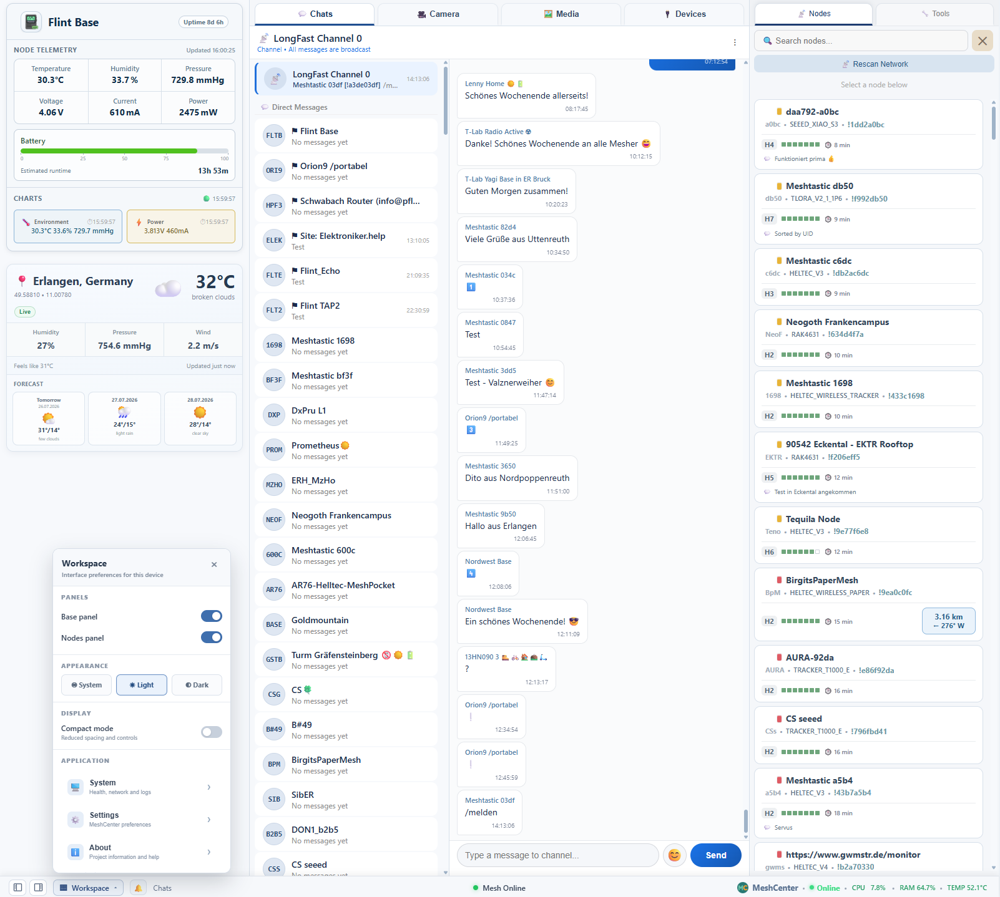
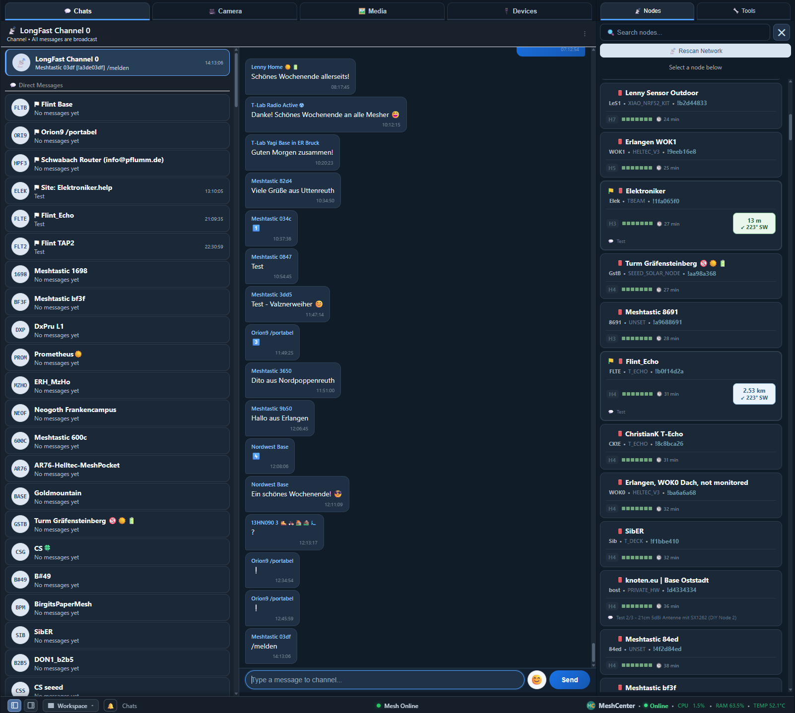
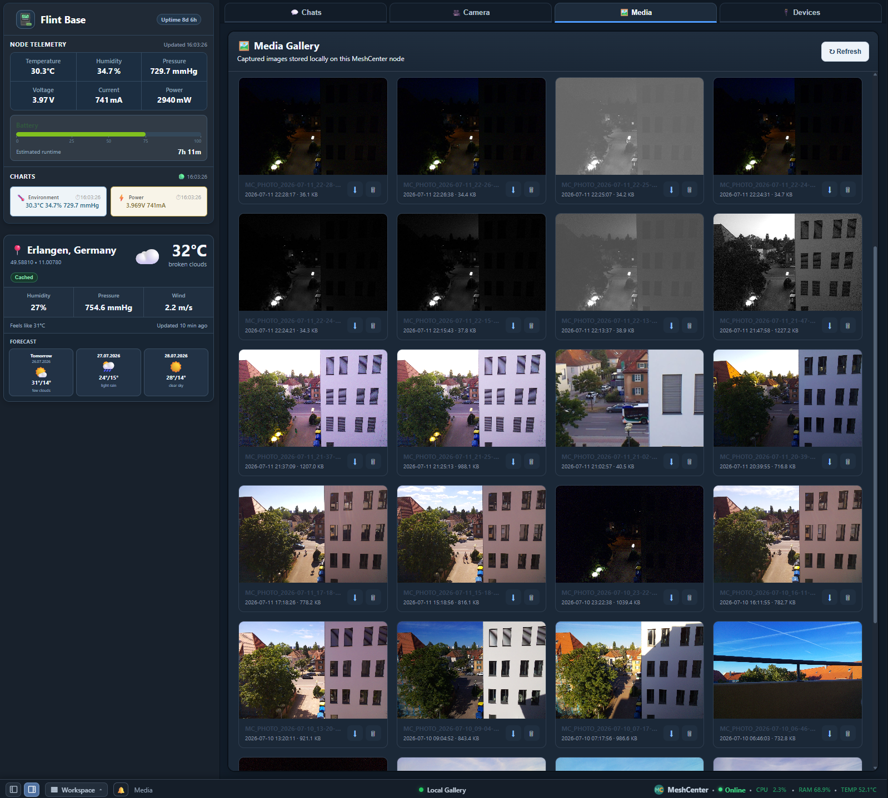
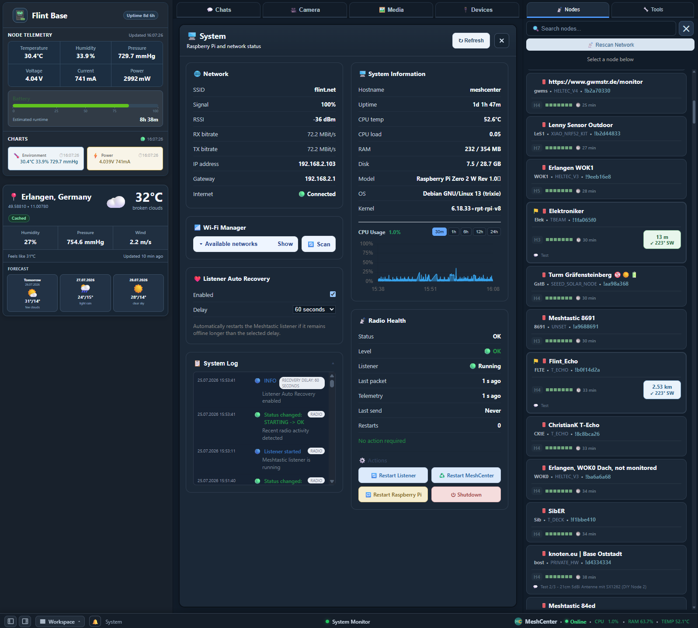
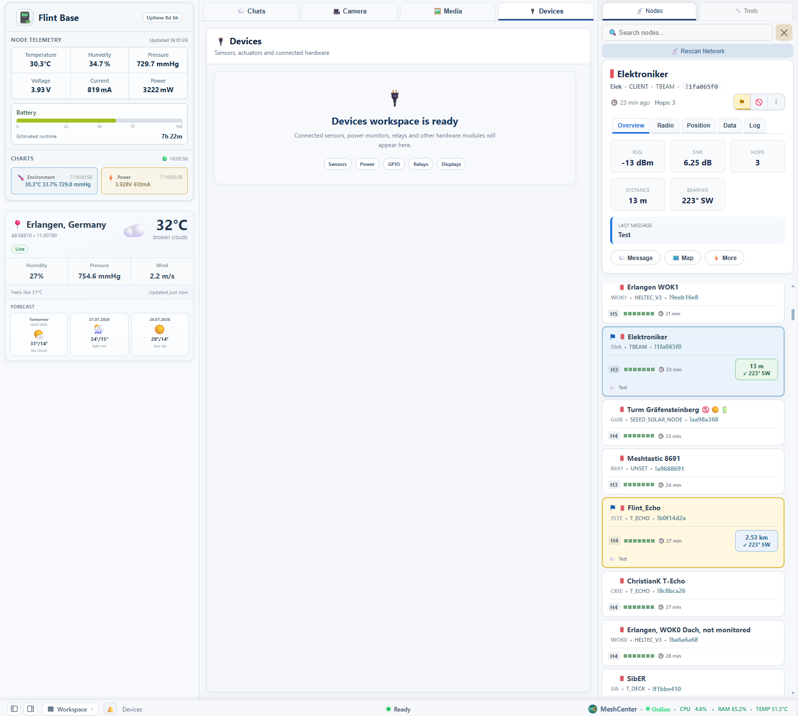

<h1 align="center">MeshCenter - Meshtastic Control Center</h1>

<p align="center">
A complete browser-based control center for Meshtastic® base stations running on Raspberry Pi.
</p>

<p align="center">
  
</p>

<p align="center">💬 Messaging · 🗺 Interactive Map · 📊 Telemetry · 📷 Camera</p>

<p align="center">📡 Node Management · ⚙ Raspberry Pi · 🌦 Weather · 📶 Wi-Fi · 🔋 Power Monitoring</p>

<h1 align="center">Meshtastic Powered</h1>

<p align="center">
  
</p>

<p align="center">
  
  
  
  
  
  
</p>

---

## Overview

**MeshCenter** is an open-source browser-based control and monitoring platform for Meshtastic nodes running on Raspberry Pi.

Unlike traditional clients, MeshCenter combines messaging, interactive maps, telemetry, camera support, media management and system monitoring into a single responsive web interface.

## 🌐 Live Demo

Explore MeshCenter in your browser:
https://meshcenter.elektroniker.help/preview/

Instead of depending solely on a mobile application, MeshCenter provides a permanent web interface that is available from any device connected to your local network. It combines messaging (with Meshtastic reply support), an interactive network map, intelligent node management, telemetry dashboards, camera streaming, media management, Wi‑Fi administration, weather information, notifications, system monitoring and documentation into a single lightweight application.

The project is optimized for Raspberry Pi Zero 2W while remaining fully compatible with more powerful Raspberry Pi models.

MeshCenter is designed as a complete control center that continuously runs alongside a Meshtastic node, providing real-time monitoring and convenient management through any modern web browser.

---

## Why MeshCenter?

The official Meshtastic applications are excellent for configuration, mobile operation and everyday communication.

MeshCenter is **not intended to replace them**. It complements the official ecosystem by providing a permanent browser-based control center for fixed stations, gateways and Raspberry Pi based installations.
MeshCenter relies on the official Meshtastic configuration stored on the connected radio. Channel management and radio configuration are performed using the official Meshtastic applications, while MeshCenter automatically detects, synchronizes and works with the configured channels.

Typical use cases include:

- Home base stations
- Portable field communication servers
- Emergency communication nodes
- Raspberry Pi gateways
- Weather monitoring stations
- Remote telemetry systems
- Educational and experimental projects

---

## ✨ Highlights

***Key Features***

- Browser-based interface
- No additional software required on client devices
- Optimized for desktop web browsers
- Responsive desktop UI
- Open source
- Designed for Raspberry Pi
- Works with standard Meshtastic firmware

### 📚 Documentation

- [Practical User Guide](docs/User_Guide.md)
- [Quick Installation](#installation)
- [Architecture Overview](#application-architecture)
- [Development Roadmap](#roadmap)

### 💬 Messaging

- MeshCenter automatically detects and synchronizes all channels configured on the connected Meshtastic node. The interface supports Meshtastic channel indexes 0–7, allowing up to eight configured channels, including the primary channel. Channel creation and radio configuration are handled by the official Meshtastic applications.
- Public channel messaging
- Direct messages
- Compatible with the official Meshtastic reply feature.
- Reply composer and quoted replies
- Jump to original message
- Message actions (copy message with sender information)
- Automatic chat updates
- Chat history
- Favorite contacts
- Ignore list
- Message export

### 🧩 Workspace Map

MeshCenter includes a fully integrated interactive map directly inside the workspace.

***Features include:***

- Embedded map without leaving the main interface
- Hide, Split and Full Screen map layouts
- Split layout with top or bottom positioning
- Live node locations
- Quick actions directly from map popups
- Automatic synchronization with node details
- External map provider support when needed

### 🗺 Network Visualization

- Display all positioned nodes
- Selected node highlighting
- Node labels
- Node information popups
- Distance and bearing visualization
- Reference location marker
- Fit Nodes view
- Automatic scrolling to selected node
- Persistent node positions

### 📷 Camera & Media Gallery

- Live MJPEG video streaming
- High-resolution photo capture
- Integrated photo gallery with thumbnails, download and delete
- Adjustable image quality and FPS
- Raspberry Pi Camera support
- Media workspace to browse local captures

### 📶 Wi-Fi Manager

- View current Wi‑Fi connection (SSID, signal strength, IP, gateway)
- Scan nearby networks with signal percentage
- Connect to new networks with password prompt
- Automatically reuse saved credentials
- Forget saved profiles

### 📈 Telemetry

- Device telemetry (battery, voltage, channel utilisation, uptime)
- Environmental sensors (temperature, humidity, pressure)
- Power monitoring (voltage, current, power)
- Historical charts with selectable time ranges (1h to 30d)
- Export telemetry data as CSV or JSON

### 🖥 Modern Desktop Interface

- Professional three‑column layout
- Responsive workspace layout
- Workspace panel (show/hide columns, theme, compact mode)
- Notification Center
- Bottom status dock with system metrics
- Improved light and dark themes
- Unified component design
- Custom node icons
- Larger and clearer map markers
- Smoother map interaction

### 📡 Node Management

- Automatic node discovery
- Hardware information and role
- RSSI / SNR monitoring
- Favorites and ignore list
- Import / Export node database (CSV / JSON)
- Merge duplicates
- Synchronized selection with interactive map
- Interactive node popups with quick actions
- Locate nodes directly on the embedded map

### 🛠️ Node Tools

- Request telemetry from any visible node
- Request position (saves coordinates)
- Traceroute – show mesh route to a node

### 🩺 System & Radio Health

- Real‑time system info (hostname, uptime, CPU, RAM, disk, temperature)
- Radio listener status, packet age, telemetry age
- Automatic listener recovery with configurable delay
- CPU usage history chart (30m to 24h)
- System actions: restart MeshCenter, reboot, shutdown

### 🌦️ Weather Module

- Current weather and 3‑day forecast via OpenWeather
- Location from manual coordinates or a reference node
- Units follow global preferences
- Auto‑refreshes every 10 minutes

### ⚙️ Web Settings Editor

- Units (temperature and pressure)
- Telemetry update interval
- Battery capacity for runtime estimation
- Listener auto‑recovery settings
- External map service
- Reference location (manual or node‑based)

### 🎨 Workspace & UI Preferences

- Persistent panel visibility, theme and compact mode per browser
- All preferences stored locally

### ⚡ Optimized for Raspberry Pi

MeshCenter has been developed with Raspberry Pi Zero 2W as the primary target platform.

Special attention has been paid to:

- Low memory usage
- Low CPU utilization
- Fast page loading
- Lightweight architecture
- Stable 24/7 operation

### 🧪 Tested Hardware Setup

MeshCenter is primarily developed and tested on a Raspberry Pi Zero 2 W connected by USB to a standard Meshtastic radio node. The radio uses standard Meshtastic firmware and does not require hardware modification or its own Wi-Fi connection.

The current reference setup includes:

- Raspberry Pi Zero 2 W
- RAK4631-based Meshtastic node connected by USB
- Raspberry Pi Camera via CSI interface
- Supported cameras:
  - IMX219 8 MP (currently installed)
  - OV5647 5 MP (tested)
- INA226 power monitor
- BME280 environmental sensor

Other Raspberry Pi models and standard Meshtastic-compatible radios with a supported USB serial connection may also work. The radio must first be configured with an official Meshtastic application. MeshCenter then uses the region, channels and channel keys already stored on it.

---

## Screenshots

<p align="center">
  
</p>

<p align="center">
  
</p>

<p align="center">
  
</p>

<p align="center">
  
</p>

<p align="center">
  
</p>

<p align="center">
  
</p>

<p align="center">
  
</p>

---

## Design Philosophy

MeshCenter follows a few simple principles:

- Browser-first experience
- Fast and responsive interface
- Reliable long-term operation
- Low resource consumption
- Simple installation
- Easy maintenance
- Full compatibility with the official Meshtastic ecosystem

The goal is to provide a practical and reliable control center that can run continuously on a Raspberry Pi while giving convenient access to the most important functions of a Meshtastic base station from any web browser.

---

## What Makes MeshCenter Different?

Unlike traditional web interfaces, MeshCenter is designed as a complete operational environment for a Meshtastic base station.

It combines multiple independent subsystems into one application:

- Messaging (including Meshtastic reply support)
- Interactive Network Map
- Camera
- Photo Gallery
- Telemetry
- Node Management
- Node Tools (telemetry request, position request, traceroute)
- System Monitoring & Radio Health
- Weather Integration
- Wi‑Fi Manager
- Local Data Storage
- Background Services
- REST API

This modular architecture makes it easy to extend the project while keeping the user interface simple and responsive.

---

## Installation

MeshCenter is designed to run on Raspberry Pi OS Bookworm and newer versions.

Although it has been primarily developed and tested on Raspberry Pi Zero 2W, it also works on Raspberry Pi 3, 4 and 5.

For complete explanations, first-run checks, interface operation, backups and troubleshooting, see the **[Practical User Guide](docs/User_Guide.md)**.

### Requirements

#### Hardware

- Raspberry Pi Zero 2W or newer
- microSD card (16 GB or larger recommended)
- Meshtastic-compatible radio with a supported USB serial connection
- Raspberry Pi Camera (optional)
- Wi-Fi or Ethernet connection for access to the web interface

#### Software

- Raspberry Pi OS Bookworm (64-bit recommended)
- Python 3.11 or newer
- Git

### Prepare Raspberry Pi OS

```bash
sudo apt update
sudo apt install -y git python3 python3-venv python3-pip network-manager iw
sudo usermod -aG dialout "$USER"
sudo reboot
```

For optional camera support, install `python3-picamera2` and `rpicam-apps` before creating the virtual environment.

### Clone the Repository

```bash
cd ~
git clone https://github.com/FlintUA/MeshCenter.git meshcenter
cd ~/meshcenter
```

### Create a Virtual Environment

Create the virtual environment with access to system packages. This is required for Picamera2 camera support:

```bash
python3 -m venv --system-site-packages venv
source venv/bin/activate
python -m pip install --upgrade pip setuptools wheel
python -m pip install -r requirements.txt
```

The requirements install Flask, Pillow, Requests, psutil and the Meshtastic Python package and CLI.

### Verify the USB radio

```bash
ls -l /dev/ttyACM* /dev/ttyUSB* 2>/dev/null
source ~/meshcenter/venv/bin/activate
meshtastic --port /dev/ttyACM0 --info
```

Do not continue until the CLI can read the connected radio without permission or serial-port errors. Replace `/dev/ttyACM0` if the radio uses another device path.

### Configuration

Copy the example configuration file:

```bash
cp config.example.py config.py
mkdir -p data
```

Open `config.py` in your preferred editor and set the serial port and local-node information:

```python
MESHTASTIC_PORT = "/dev/ttyACM0"

LOCAL_NODE_ID = "!xxxxxxxx"
LOCAL_NODE_NAME = "My Base Station"
```

The example configuration resolves `MESHTASTIC_CMD` and `DATA_DIR` automatically from the project directory. `config.py`, `weather_secrets.py` and `data/` are local files and are not changed by normal Git updates.

For optional weather support, copy `weather_secrets.example.py` to `weather_secrets.py` and place the OpenWeather API key there.

### Starting MeshCenter

Run manually:

```bash
cd ~/meshcenter
source venv/bin/activate
python server.py
```

The web interface will be available at:

```
http://<raspberry-pi-ip>:5000
```

### Running as a Service

Render the supplied systemd template with the current username and home directory:

```bash
cd ~/meshcenter
MESH_USER="$(id -un)"
MESH_HOME="$HOME"
sed -e "s|__MESH_USER__|$MESH_USER|g" \
    -e "s|__MESH_HOME__|$MESH_HOME|g" \
    deploy/meshcenter.service \
    | sudo tee /etc/systemd/system/meshcenter.service >/dev/null

sudo systemctl daemon-reload
sudo systemctl enable --now meshcenter.service
sudo systemctl status meshcenter.service --no-pager -l
```

The optional System and Wi-Fi actions also require the narrowly scoped rules in `deploy/meshcenter.sudoers` and `deploy/meshcenter-wifi.sudoers`. The complete rendering and validation commands are in the [Practical User Guide](docs/User_Guide.md#enable-system-and-wi-fi-actions).

### Updating MeshCenter Safely

Check for local changes before updating:

```bash
cd ~/meshcenter
git status --short --branch
```

If tracked files are modified, review them before continuing. Then back up `config.py` and `data/` and run:

```bash
git pull --ff-only origin main
source venv/bin/activate
python -m pip install -r requirements.txt
python -m compileall -q server.py api camera meshsrv storage telemetry utils
sudo systemctl restart meshcenter.service
sudo systemctl is-active meshcenter.service
git status --short --branch
```

Use `Ctrl+F5` in the browser after an interface update. This update sequence was verified on a clean second Raspberry Pi installation.

---

## Project Structure

MeshCenter has been designed as a modular application. Each subsystem has its own responsibility, making the project easier to maintain, debug and extend.

A typical installation looks like this:

```
meshcenter/
│
├── api/                # REST API endpoints
├── camera/             # Camera subsystem
├── meshsrv/            # Meshtastic communication layer
├── storage/            # JSON storage helpers
├── telemetry/          # Telemetry processing
├── utils/              # Shared utility functions
│
├── static/             # CSS, JavaScript, icons
├── templates/          # HTML templates
├── data/               # Persistent application data (messages, nodes, photos, icons, settings)
├── docs/               # Documentation and images
│   └── User_Guide.md   # Installation and practical operation guide
│
├── venv/               # Python virtual environment
│
├── config.py           # Local configuration (not in git)
├── config.example.py   # Example configuration
├── requirements.txt
├── server.py           # Main application entry point
└── README.md
```

The `data` directory stores persistent information such as messages, telemetry history, node icons, camera photos and application settings.

---

## Tech Stack

MeshCenter is built with a lightweight and practical technology stack:

- Python
- Flask
- HTML5
- CSS3
- JavaScript
- Meshtastic Python API
- Raspberry Pi OS / Linux
- systemd
- Git and GitHub
- Leaflet
- OpenStreetMap

## Core Features

MeshCenter combines several independent subsystems into one control center. Each subsystem is designed to be useful on its own, but together they turn a Raspberry Pi into a practical Meshtastic base station.

### 📚 Documentation

- UI Guidelines
- Components
- Architecture
- Development Roadmap

### 💬 Messaging

MeshCenter provides a browser-based chat interface for Meshtastic communication.

The messaging system supports both public channel messages and direct node-to-node messages.

#### Public Channel

Public messages are sent to the configured Meshtastic channel, usually LongFast channel index 0.

Typical use cases:

- Local mesh chat
- Community messages
- Field communication
- Test messages
- Sensor status announcements

#### Direct Messages

MeshCenter also supports direct messages between nodes.

Direct messages are shown as separate chats, making it easier to work with multiple known nodes from a browser interface.

#### Messaging Features

- Public channel messaging
- Direct node-to-node messaging
- Native Meshtastic reply support
- Reply composer
- Quoted replies
- Jump to original message
- Message actions
- Copy including sender name
- Improved Direct Messages
- Chat history
- Automatic message refresh
- Message timestamps
- Favorite chats
- Ignore list
- Emoji picker
- System messages
- Local JSON-based storage

### 🗺 Interactive Network Map

MeshCenter includes an integrated Leaflet-based interactive map for visualizing the mesh network.

The map is built into the application and can be opened directly from the **Show on map** action. It displays all nodes that have a known position, along with a reference location marker used for distance and bearing calculations.

Node positions are stored locally on the Raspberry Pi and persist across restarts.

#### Map Features

- Integrated Leaflet-based map inside MeshCenter
- Open map directly from **Show on map**
- Display all positioned nodes
- Reference location marker
- Selected node highlighting
- Node labels
- Node information popups
- Distance and bearing visualization
- Fit Nodes view
- Synchronized node selection between map and node list
- Automatic scrolling to selected node
- Persistent node positions

#### Map UI and Performance

- Redesigned map panel
- Larger and clearer map markers
- Better popup positioning
- Improved selection colors and node highlighting
- Smoother map interaction
- Faster map updates and reduced unnecessary redraws
- Optimized map refresh logic and node synchronization

Node selection is synchronized between the map and the node list: selecting a node on the map highlights it in the list (and scrolls to it), and selecting a node in the list highlights it on the map.

> **Note:** The integrated map uses Leaflet with OpenStreetMap tiles. The separate **Map provider** setting (OpenStreetMap / Google Maps) controls only external “open in maps” links for individual node positions, not the built-in map.

### 🖥 Modern Desktop Interface

- Professional three-column layout
- Redesigned map panel
- Workspace panel
- Notification Center
- Bottom status dock
- Improved light and dark themes
- Better spacing and layout consistency
- Unified component design
- Custom node icons
- Responsive dashboard

### 📡 Node Management

MeshCenter automatically discovers nodes from the Meshtastic mesh and stores them locally.

The node list helps you understand what devices are visible in your area and when they were last heard.

#### Node Information

Depending on the available data, MeshCenter can display:

- Long name
- Short name
- Node ID
- Hardware model
- Role
- Last seen time
- RSSI
- SNR
- Hop distance
- Last message

#### Favorites

Frequently used nodes can be marked as favorites.

Favorites are useful for:

- Your own devices
- Family nodes
- Field team nodes
- Known repeaters
- Important contacts

#### Ignore List

Nodes that are not relevant can be ignored.

Ignored nodes remain in the database, but they can be hidden from the main view and filtered out from normal interaction.

This is useful in busy areas where many nodes are visible but only a few are important for your setup.

#### Import and Export

MeshCenter supports importing and exporting the local node database in CSV and JSON formats.

This is useful for:

- Backups
- Moving to another Raspberry Pi
- Keeping a known node list
- Sharing node information between installations

### 🛠️ Node Tools (Remote Commands)

MeshCenter can send commands to any visible node directly from the web interface:

- **Request Telemetry** – Ask the node to send its current sensor readings (temperature, humidity, pressure, voltage, current, power)
- **Request Position** – Request the node's GPS or fixed position; the result is saved and displayed
- **Traceroute** – Show the mesh route to the destination node, both forward and return paths

These tools are available from the node detail card and the Node Tools button.

### Custom Node Icons

You can upload a custom image (PNG, JPEG or WebP) for any node (including the local base node). The image is automatically centered and cropped into a 256×256 transparent square. Icons are stored locally on the Raspberry Pi and are served by MeshCenter.

### 📈 Telemetry

MeshCenter displays telemetry received from Meshtastic devices and stores historical telemetry locally.

Telemetry is useful for monitoring both the radio node and connected sensors.

#### Device Telemetry

Supported device telemetry includes:

- Battery level
- Voltage
- Channel utilization
- Air utilization
- Uptime
- Last update time

#### Environmental Telemetry

Environmental telemetry can include:

- Temperature
- Humidity
- Atmospheric pressure

Typical sensor: **BME280**

#### Power Monitoring

Power telemetry can include:

- Voltage
- Current
- Power

Typical sensor: **INA226**

#### Telemetry History

Telemetry history is stored locally and can be displayed as charts with selectable time ranges (1 hour to 30 days). Data can be exported as CSV or JSON.

### 📷 Camera

MeshCenter includes camera support based on Raspberry Pi Camera and Picamera2.

The camera subsystem is designed for lightweight live viewing and photo capture on low-power hardware.

#### Live Video

Live video is provided as an MJPEG stream.

MJPEG is not the most bandwidth-efficient video format, but it has excellent browser compatibility and works reliably without additional client-side software.

#### Photo Capture

MeshCenter can capture high-resolution photos and store them locally.

The application can use different settings for:

- Live preview
- Video mode
- Photo capture

This allows the system to keep the live view lightweight while still supporting full-resolution image capture.

#### Camera Settings

Depending on the connected camera, MeshCenter can support:

- Video resolution
- Photo resolution
- FPS
- JPEG quality
- Preview size
- Save size

#### Gallery

Captured images are saved locally and can be viewed through the Media workspace. The gallery displays thumbnails, file size, capture time and provides download and delete actions.

### 🖼️ Media Gallery

MeshCenter stores captured photos inside the local data directory.

The gallery provides browser-based access to saved images without requiring SSH or file browser access to the Raspberry Pi.

Typical use cases:

- Checking recent camera captures
- Reviewing field images
- Downloading saved photos
- Keeping a visual project log

The gallery shows total image count, used space and free space. You can delete individual images or clear the entire gallery.

**Note:** The term “screenshots” in the storage directory and some internal references refers to photos captured by the Raspberry Pi Camera. The interface screenshots shown in this README are illustrative images of the web UI and are not stored by the application.

Photos are stored locally and are **not** transmitted through Meshtastic.

### ⚙️ Local Storage

MeshCenter stores application data locally using JSON files.

This keeps the project simple and easy to inspect, backup and repair.

Typical stored files include:

```
messages.json
nodes.json
chats.json
sensors.json
telemetry_history.json
deleted_dm.json
settings.json
camera_config.json
node_icons/
screenshots/          # camera photos
```

Local storage is useful because:

- No external database is required
- Backups are easy
- Files can be inspected manually
- The system remains lightweight
- The installation stays simple

### 🩺 System Monitor & Radio Health

MeshCenter provides a dedicated System workspace that gives you full visibility into your Raspberry Pi and Meshtastic radio status.

#### System Information

- Hostname, uptime, CPU load and temperature
- RAM usage (used / total)
- Disk usage (used / total)
- Raspberry Pi model and OS version

#### Radio Health Dashboard

- Listener status (running / stopped / paused)
- Packet age, telemetry age and send age
- Status level (OK, Warning, Error)
- Restart count and fail count
- A recommendation message for troubleshooting

#### CPU History Chart

- Live CPU usage graph with selectable ranges: 30m, 1h, 6h, 12h, 24h
- Current CPU usage, RAM usage and temperature are also shown in the status dock

#### System Log

- A detailed event log showing listener starts, stops, errors and system actions
- Logs are stored persistently and can be viewed directly in the System workspace

#### Automatic Listener Recovery

- If the Meshtastic listener stops, MeshCenter can automatically restart it after a configurable delay (30–300 seconds)
- The recovery mechanism respects a safety limit (max 3 attempts in 30 minutes) to avoid restart loops

### 🌦️ Weather Module

MeshCenter integrates with OpenWeather to show current weather conditions and a 3‑day forecast for your location.

- **Server-side API key** - The OpenWeather API key is stored in the local `weather_secrets.py` file and never exposed to the browser
- **Caching** – Weather data is cached for 10 minutes to reduce API calls
- **Location sources**:
  - Manual coordinates (set in the web Settings)
  - Reference node position (if the node has GPS)
  - Static configured coordinates (fallback from `config.py`)
- **Units** – Follow global unit preferences (temperature, pressure, wind speed)
- **Forecast** – Shows the next three days with temperature ranges, weather condition and precipitation probability
- **Refresh** – Click the status badge to force an immediate update

The weather card is displayed in the Base panel and updates automatically every 10 minutes.

### 🎨 Workspace & UI Preferences

MeshCenter remembers your interface preferences per browser using local storage.

- **Panel visibility** – Show or hide the Base and Nodes panels
- **Theme** – System (follows OS), Light or Dark
- **Compact mode** – Reduced spacing and control sizes for smaller screens

All changes are saved automatically and applied on next visit.

Access the Workspace menu from the bottom‑left status dock.

### ⚙️ Web Settings Editor

MeshCenter provides a graphical settings interface accessible from the Workspace menu.

You can adjust the following without editing configuration files:

- **Units** - Temperature (°C/°F) and pressure (hPa/mmHg)
- **Telemetry interval** – How often sensor readings are stored (2, 5, 10, 15, 30 minutes)
- **Battery capacity** – Used for runtime estimation (100–50000 mAh)
- **Listener auto‑recovery** – Enable/disable, delay (30–300 seconds)
- **Map provider** – OpenStreetMap or Google Maps for external node-position links (does not affect the integrated Leaflet map)
- **Reference location** – Set a manual coordinate or select a node as the reference for distance/bearing calculations on the map

All settings are saved immediately and persist across restarts.

### 🧩 Modular Architecture

MeshCenter is gradually moving from a single large server file to a modular architecture.

Current modules include:

```
api/
camera/
meshsrv/
storage/
telemetry/
utils/
```

This makes the project easier to maintain and extend.

The goal is to keep `server.py` as the central coordinator while moving specialized logic into dedicated modules.

---

## Camera Notes

Camera support depends on Raspberry Pi system packages.

The recommended way to create the virtual environment (with `--system-site-packages`) is already described in the installation section. Without this option, Python inside the virtual environment may not see system packages such as:

- Picamera2
- Pillow (system version)
- libcamera-related bindings

To test camera imports:

```bash
source venv/bin/activate
python - <<'PY'
try:
    from picamera2 import Picamera2
    print("Picamera2 OK")
except Exception as e:
    print("Picamera2 ERROR:", e)

try:
    from PIL import Image
    print("Pillow OK")
except Exception as e:
    print("Pillow ERROR:", e)
PY
```

### Recommended Camera Settings

For Raspberry Pi Zero 2W, conservative camera settings are recommended.

| Setting            | Recommended          |
|--------------------|----------------------|
| Video Resolution   | 640 × 480 or 800 × 600 |
| FPS                | 8–15                 |
| JPEG Quality       | 70–85                |
| Photo Preview      | 640 × 480            |
| Photo Capture      | 3280 × 2464          |

Higher settings may work, but they increase CPU usage, memory usage and heat.

### Recommended Raspberry Pi Zero 2W Usage

Raspberry Pi Zero 2W is powerful enough for MeshCenter, but it has limited resources.

For best stability:

- Avoid unnecessarily high video FPS
- Avoid very high JPEG quality for live video
- Keep browser polling intervals reasonable
- Use a reliable power supply
- Use a good microSD card
- Keep the enclosure ventilated
- Monitor CPU temperature during long camera sessions

MeshCenter is designed to remain lightweight, but camera streaming and photo capture can still temporarily increase system load.

---

## Application Architecture

MeshCenter consists of several independent modules that work together.

```
                    Web Browser
                          │
                          │ HTTP
                          ▼
                   Flask Application
                          │
     ┌──────────────┬──────────────┬──────────────┬──────────────┐
     │              │              │              │              │
     ▼              ▼              ▼              ▼              ▼
 Messaging      Camera        Telemetry      System/Health   REST API
     │              │              │              │
     └──────────────┼──────────────┴──────────────┘
                    ▼
             Meshtastic CLI
                    │
                    ▼
             LoRa Radio Device
```

The browser never communicates directly with the Meshtastic node. All communication is handled by the Flask application, which coordinates the different subsystems.

---

## Data Storage

MeshCenter intentionally avoids using an SQL database.

Instead, all application data is stored as JSON files.

**Advantages of this approach:**

- No database server required
- Easy backups
- Human-readable files
- Simple migration between Raspberry Pi devices
- Easy recovery after unexpected shutdowns

Typical stored files include:

```
messages.json
nodes.json
chats.json
telemetry_history.json
deleted_dm.json
sensors.json
settings.json
camera_config.json
node_icons/
screenshots/
```

Future versions may optionally support SQLite for installations with very large datasets, but JSON storage will remain the default.

---

## REST API

MeshCenter exposes a REST API used by the browser interface.

Examples of available endpoints include:

```
GET    /api/chats
GET    /api/messages
POST   /api/send

GET    /api/telemetry
GET    /api/telemetry/history
POST   /api/telemetry/config

GET    /api/sensors
GET    /api/base_status
GET    /api/radio_health

GET    /api/system/info
GET    /api/system/network
GET    /api/system/cpu-history
POST   /api/system/action

GET    /api/nodes
GET    /api/nodes_management
POST   /api/nodes_import
GET    /api/nodes_export

POST   /api/node_tools

GET    /api/camera/status
POST   /api/camera/settings
POST   /api/photo/capture
POST   /api/photo/save

GET    /api/weather/current
```

The API is primarily intended for the built-in web interface, but it also allows future integrations with third-party applications.

---

## Performance

MeshCenter has been optimized for Raspberry Pi Zero 2W.

Typical resource usage depends on the enabled features. Approximate values measured on a Raspberry Pi Zero 2W:

| Feature             | CPU (approx.)      | RAM (approx.) |
|---------------------|--------------------|---------------|
| Idle                | < 5 %              | 40–60 MB      |
| Messaging           | 5–15 %             | 50–80 MB      |
| Telemetry           | 5–10 %             | 50–70 MB      |
| Camera Preview      | 25–50 %            | 80–120 MB     |
| Photo Capture       | short peak 60–90 % | 90–130 MB     |
| System Monitoring   | 5–10 %             | 50–70 MB      |

Live MJPEG streaming is currently the most resource-intensive component. Values can vary depending on resolution, FPS, JPEG quality and the number of connected browser clients.

---

## Security

MeshCenter is intended for trusted local networks.

Current security model:

- Local network access
- No cloud dependency
- No external database
- Local JSON storage
- Local camera storage

If remote access is required, it is recommended to use a VPN or another secure tunnel instead of exposing the web interface directly to the Internet.

Future versions may include optional authentication.

---

## Recent Improvements

- **Interactive Network Map** – Integrated Leaflet-based map with positioned nodes, reference marker, distance/bearing, synchronized selection with the node list, persistent positions, Fit Nodes view and node information popups
- **Messaging Improvements** – Native Meshtastic reply support, reply composer, quoted replies, jump to original message, message actions and improved Direct Messages
- **Map UI & Performance** – Redesigned map panel, larger markers, smoother interaction, faster updates, reduced redraws and optimized refresh logic
- **System & Radio Health** – Added system monitoring, radio health dashboard, CPU history chart and automatic listener recovery
- **Weather Module** – Integrated OpenWeather with caching and location from reference node
- **Node Tools** – Added remote telemetry, position request and traceroute
- **Custom Node Icons** – Upload and manage icons for any node
- **Workspace & UI** – Persistent panel visibility, theme, compact mode; improved light/dark themes and layout consistency
- **Web Settings Editor** – Units, telemetry interval, battery capacity, listener recovery, external map-link provider, reference location
- **Media Gallery** – Thumbnails, download, delete, storage info
- **Export/Import** – Node database export/import in CSV and JSON
- **Wi‑Fi Manager** – Scan, connect, forget with saved networks indicator

---

## Troubleshooting

### Meshtastic CLI not found

Check that the CLI is installed inside the virtual environment:

```bash
source venv/bin/activate
which meshtastic
```

Verify the configured path in `config.py`.

### Radio not detected

Verify that the device is connected:

```bash
ls /dev/ttyACM*
```

Test communication:

```bash
source venv/bin/activate
meshtastic --info
```

### Camera not working

Verify that Picamera2 is available:

```bash
source venv/bin/activate
python -c "from picamera2 import Picamera2"
```

If the import fails, recreate the virtual environment with system site packages:

```bash
deactivate
rm -rf venv
python3 -m venv --system-site-packages venv
source venv/bin/activate
pip install -r requirements.txt
```

### Service does not start

Check the service status:

```bash
systemctl status meshcenter
```

View the logs:

```bash
journalctl -u meshcenter -f
```

### High CPU usage

Possible causes:

- High MJPEG frame rate
- Large preview resolution
- High JPEG quality
- Multiple browser clients
- Background image processing

Reducing camera settings usually has the greatest impact.

### Messages are not delivered

Verify:

- Same LoRa region
- Same channel
- Same PSK
- Compatible firmware versions
- Target node is reachable

Use the Meshtastic CLI to verify that communication works outside MeshCenter.

### Browser cannot connect

Verify that Flask is listening:

```bash
ss -tln
```

Default port: `5000`

Also check your firewall configuration.

### Weather data not showing

- Verify that `OPENWEATHER_API_KEY` is set in `weather_secrets.py`
- Check that the reference location is configured (Settings → Reference location)
- Ensure the Raspberry Pi has internet access

### Node Tools commands fail

- Check that the target node is reachable (last heard time is recent)
- Ensure the serial port is not busy (wait a few seconds and retry)
- Check the System Log for detailed error messages

### Custom node icons not updating

- Clear your browser cache or reload the page with `Ctrl+F5`
- Verify that the uploaded image is a valid PNG, JPEG or WebP

### Wi‑Fi connection fails

- Check that the password is correct
- Ensure the network is visible in the scan list
- Verify that NetworkManager is installed and running

---

## Frequently Asked Questions

### Does MeshCenter support mobile devices?

MeshCenter is currently optimized for desktop web browsers. It is partially usable on many tablets, while full mobile optimization is planned for a future release.

### Does MeshCenter replace the official Meshtastic application?

No. MeshCenter complements the official applications by providing a permanent browser-based control center for Raspberry Pi installations.

### Does MeshCenter send photos over Meshtastic?

No. Photos are stored locally on the Raspberry Pi and viewed through the web interface.

### Can multiple browsers connect simultaneously?

Yes. Multiple users on the same local network can access the interface at the same time.

### Does MeshCenter require Internet access?

No. Internet access is not required for normal operation.

Some optional features, such as weather integration, external map tiles and software updates, require Internet connectivity.

### Which Raspberry Pi models are supported?

Recommended:

- Raspberry Pi Zero 2W
- Raspberry Pi 3
- Raspberry Pi 4
- Raspberry Pi 5

MeshCenter is primarily optimized for Raspberry Pi Zero 2W.

---

## Roadmap

MeshCenter is an actively developed project.

The primary goal is to provide a lightweight, reliable and feature-rich browser-based control center for Meshtastic base stations while keeping the installation simple and resource-efficient.

The roadmap is intentionally conservative. Features are added only after they have been tested and integrated without compromising stability.

### Current Development

#### 📈 Improved Telemetry

Future versions will extend telemetry visualization with:

- Better historical charts
- Long-term statistics
- Improved graph rendering
- Additional sensor support
- Improved data export

#### 🚀 Performance Improvements

Continuous optimization remains an important goal.

Future work includes:

- Faster page loading
- Lower memory usage
- Reduced CPU utilization
- Better responsiveness
- Improved camera performance

### Future Ideas

These ideas are being considered for future releases.  
Their implementation depends on project maturity and available development time.

#### 🧩 Plugin Support

A plugin architecture could allow optional modules without increasing the complexity of the core application.

Possible plugins:

- Weather services
- Telegram notifications
- MQTT integration
- Grafana / InfluxDB exporters
- APRS gateway
- Custom sensor modules

#### 🗺 Network Map Enhancements

Further map improvements under consideration:

- Signal quality overlays
- Routing / traceroute visualization on the map
- Favorite node emphasis
- Last-heard indicators

#### 🌍 Multi-language Interface

Support additional user interface languages.

Possible languages include:

- English
- German
- Ukrainian
- Russian

English will remain the primary project language.

#### 📦 Additional Integrations

Possible future integrations include:

- Home Assistant
- Node-RED
- MQTT brokers
- REST integrations
- Additional environmental sensors

---

## Contributing

Contributions are welcome.

If you find a bug, have an idea for an improvement or would like to contribute code, please open an Issue or submit a Pull Request.

Suggestions for improving the documentation are also greatly appreciated.

### Reporting Issues

When reporting a problem, please include as much information as possible.

Useful information includes:

- Raspberry Pi model
- Raspberry Pi OS version
- Python version
- Meshtastic firmware version
- Meshtastic CLI version
- Browser
- Relevant log messages
- Steps required to reproduce the issue

Providing detailed information helps identify and resolve problems more quickly.

---

## License

This project is released under the MIT License.

You are free to use, modify and distribute the software in accordance with the terms of the license.

See the [LICENSE](LICENSE) file for details.

---

## Acknowledgements

Special thanks to:

- The Meshtastic Team
- The Raspberry Pi Foundation
- The open-source community
- Everyone who tests MeshCenter and shares feedback

Their work and support make projects like this possible.

---

## Support

If you enjoy the project, consider supporting it by:

- ⭐ Starring the repository
- Reporting bugs
- Suggesting new features
- Sharing the project with other Meshtastic users
- Contributing improvements

Community feedback plays an important role in shaping future development.

---

## Author

**Kostiantyn Vynohradov (FlintUA)**  
Electronics engineer, embedded systems enthusiast and Meshtastic hobbyist.

- Interactive Live Demo MeshCenter - Meshtastic Control Center: https://meshcenter.elektroniker.help/preview/
- Information Center MeshCenter - Meshtastic Control Center: https://meshcenter.elektroniker.help/
- GitHub: [https://github.com/FlintUA](https://github.com/FlintUA)
- Project repository: [https://github.com/FlintUA/MeshCenter](https://github.com/FlintUA/MeshCenter)
- Website: [https://elektroniker.help](https://elektroniker.help)

The website contains additional articles, practical projects and experiments related to Meshtastic, Raspberry Pi, embedded systems, electronics and 3D printing.

---

## Disclaimer

MeshCenter is an independent open-source project created for the Meshtastic community.

It is not affiliated with or endorsed by the official Meshtastic project.

Meshtastic® is a trademark of its respective owners.

---

<p align="center">
Made with ❤️ for the Meshtastic community
</p>
