<h1 align="center">MeshCenter - Meshtastic Control Center</h1>

<p align="center">
A complete browser-based control center for Meshtastic® base stations running on Raspberry Pi.
</p>

<p align="center">
  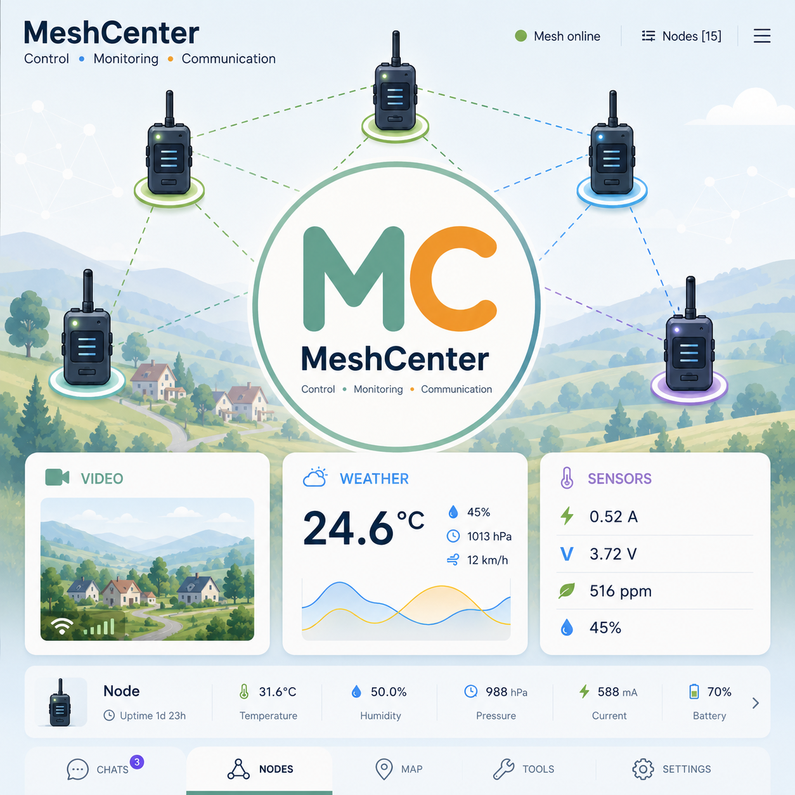
</p>

<p align="center">💬 Messaging · 🗺 Interactive Map · 📊 Telemetry · 📷 Camera</p>

<p align="center">📡 Node Management · ⚙ Raspberry Pi · 🌦 Weather · 📶 Wi-Fi · 🔋 Power Monitoring</p>

<h1 align="center">Meshtastic Powered</h1>

<p align="center">
  
</p>

<p align="center">
  
  
  
  
  
  
</p>

---

## Overview

**MeshCenter** is an open-source browser-based control and monitoring platform for Meshtastic nodes running on Raspberry Pi. Unlike traditional clients, it combines messaging, an interactive map, telemetry, camera support, file transfer, media management and system monitoring into a single responsive web interface that runs continuously alongside the radio — reachable from any device on the local network, not just a mobile app.

The project is optimized for Raspberry Pi Zero 2W while remaining fully compatible with more powerful Raspberry Pi models.

## 🌐 Live Demo

Explore MeshCenter in your browser: https://meshcenter.elektroniker.help/preview/

---

## Why MeshCenter?

The official Meshtastic applications are excellent for configuration, mobile operation and everyday communication. MeshCenter is **not intended to replace them** — it complements the official ecosystem with a permanent browser-based control center for fixed stations, gateways and Raspberry Pi based installations. MeshCenter relies on the official Meshtastic configuration already stored on the radio; channel management and radio configuration are still done with the official Meshtastic applications.

Typical use cases: home base stations, portable field communication, emergency communication nodes, Raspberry Pi gateways, weather monitoring stations, remote telemetry, and educational/experimental projects.

---

## License

MeshCenter's own code (`server.py`, `api/`, `meshsrv/`, `static/`, `templates/`, and everything else outside `adapters/`) is MIT-licensed — see [LICENSE](LICENSE).

The official [`meshtastic`](https://github.com/meshtastic/python) Python package, used to talk to the radio, is GPLv3-licensed. To keep GPLv3 code from linking into MeshCenter's own MIT-licensed process, it's isolated in `adapters/meshtastic/` — its own package, its own virtual environment, running as a **separate OS process** that Core talks to over a local IPC boundary. Core itself never imports `meshtastic`. `adapters/meshtastic/` is **GPLv3-licensed as a whole**, not just the dependency it wraps, and ships its own [LICENSE](adapters/meshtastic/LICENSE). USB camera support uses the same arm's-length-external-program pattern for `ffmpeg`/`v4l-utils` (GPL-2.0-or-later).

See [THIRD_PARTY_NOTICES.md](THIRD_PARTY_NOTICES.md) for the full dependency breakdown, and [docs/architecture/Architecture.md](docs/architecture/Architecture.md#license-boundary-why-theres-a-subprocess-at-all) for the technical detail of why this is a process boundary rather than just a code-directory split.

---

## 📸 Screenshots

*These screenshots are from v1.5.0 — the overall layout is still representative, but the current interface also has a **Files** tab (MCAttach) alongside Chats/Camera/Media/Devices that isn't shown here. Refreshing these from a current install is tracked as a follow-up.*

<details>
<summary>🗺️ Map — Light theme</summary>

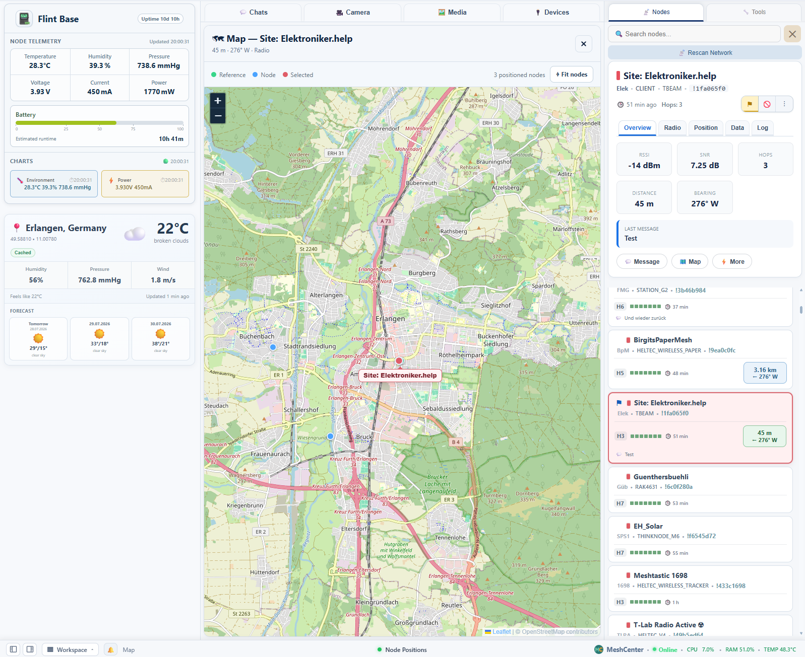

</details>

<details>
<summary>🗺️ Map — Dark theme</summary>

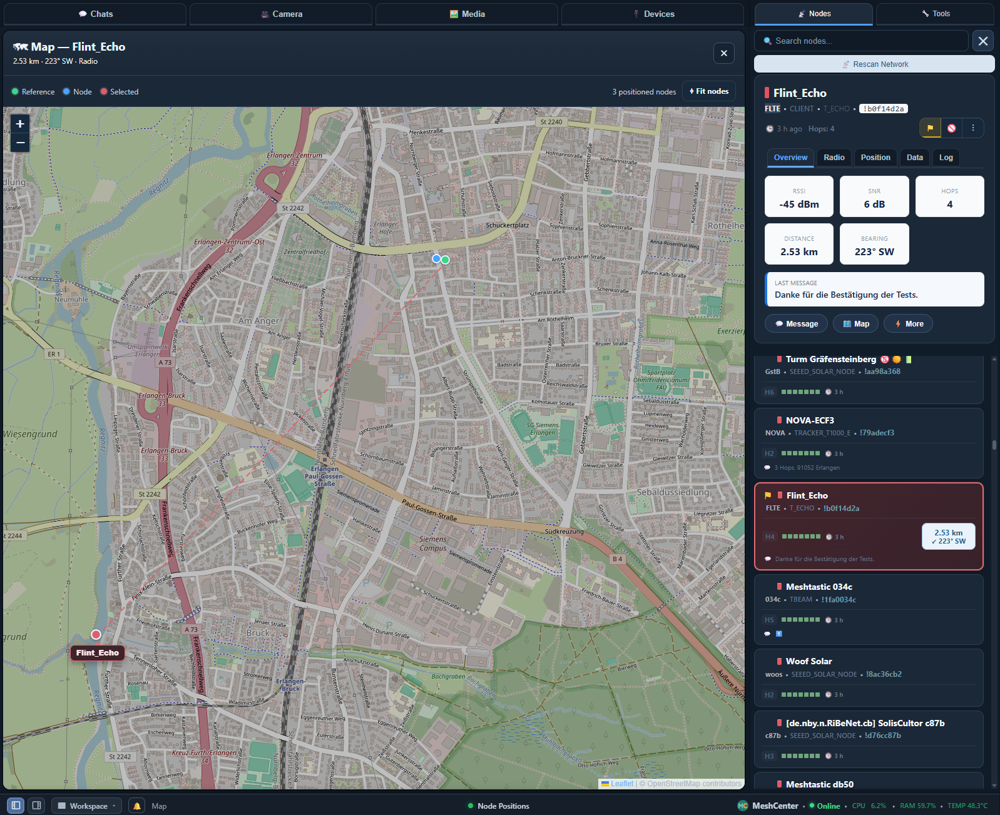

</details>

<details>
<summary>🗺️ Map + Nodes panel — Light theme</summary>

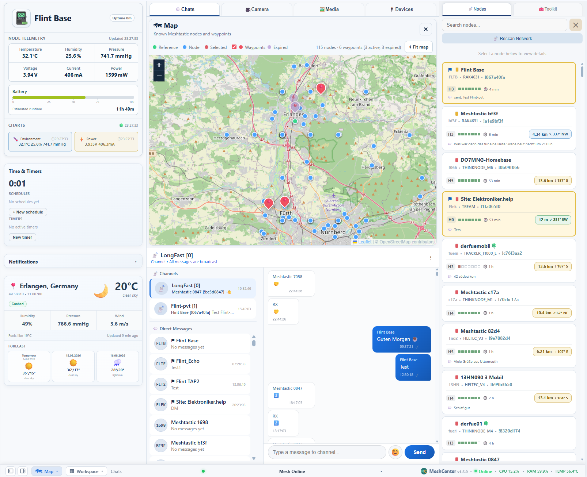

</details>

<details>
<summary>🗺️ Map + Nodes panel — Dark theme</summary>

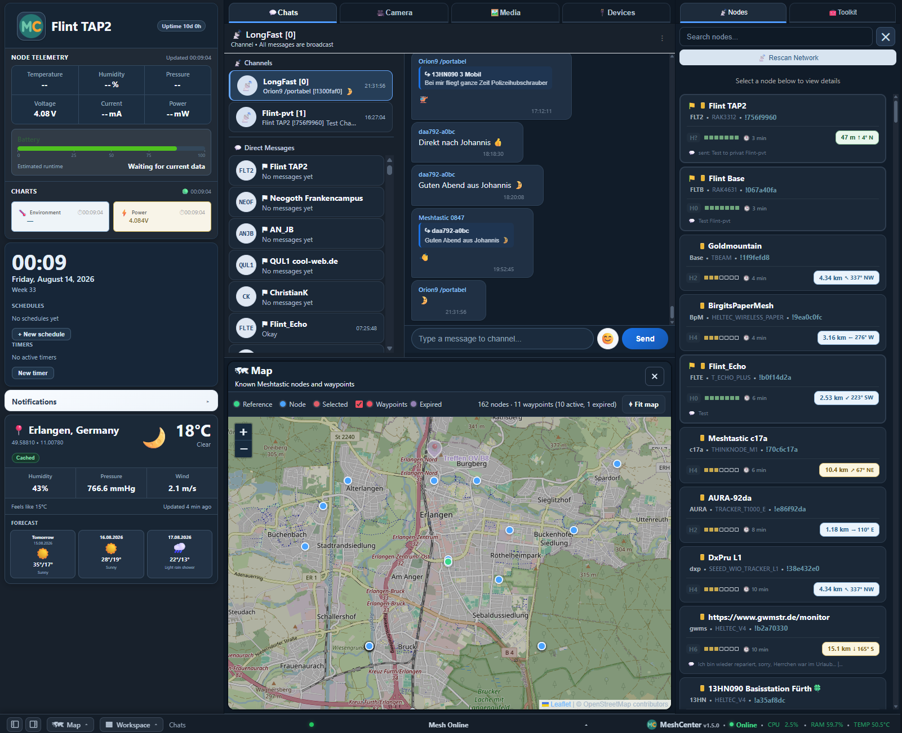

</details>

<details>
<summary>💬 Chats — Light theme</summary>

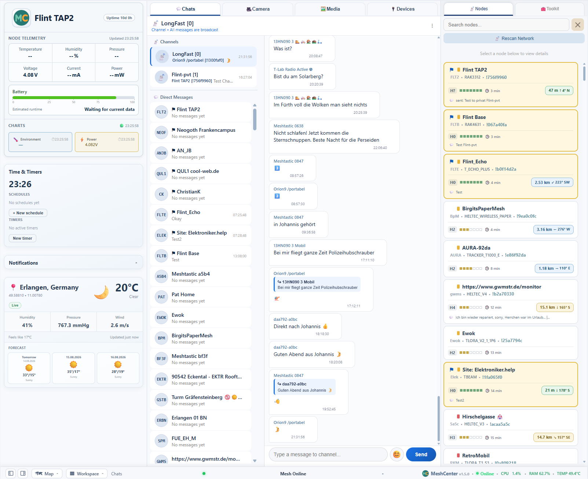

</details>

<details>
<summary>💬 Chats + Nodes panel — Dark theme</summary>

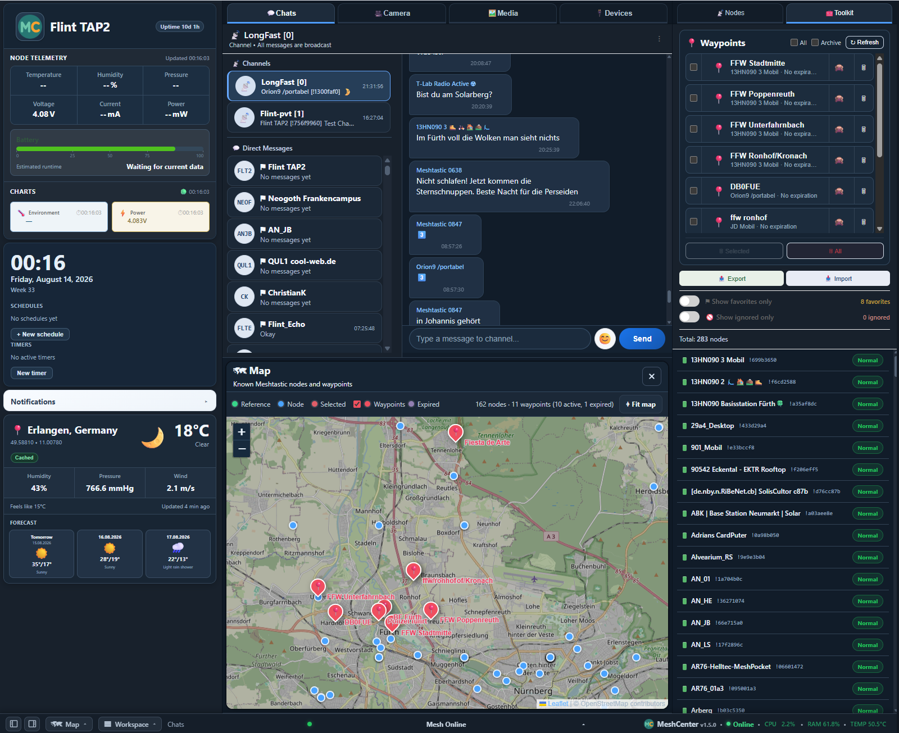

</details>

<details>
<summary>🖼️ Media — Light theme</summary>

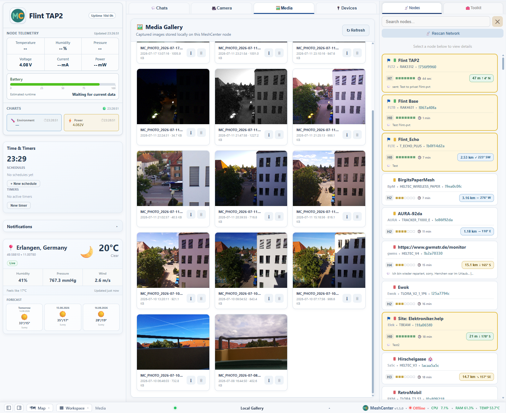

</details>

<details>
<summary>🖼️ Media + Nodes panel — Light theme</summary>

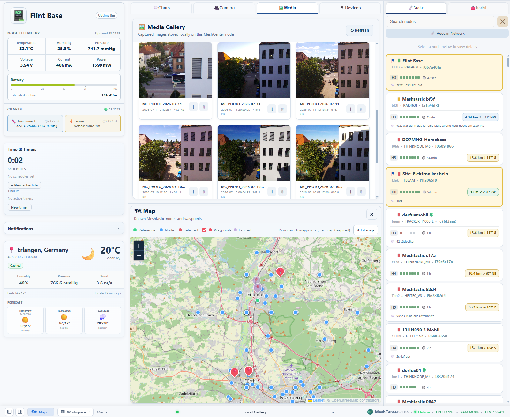

</details>

<details>
<summary>📷 Camera — Light theme</summary>

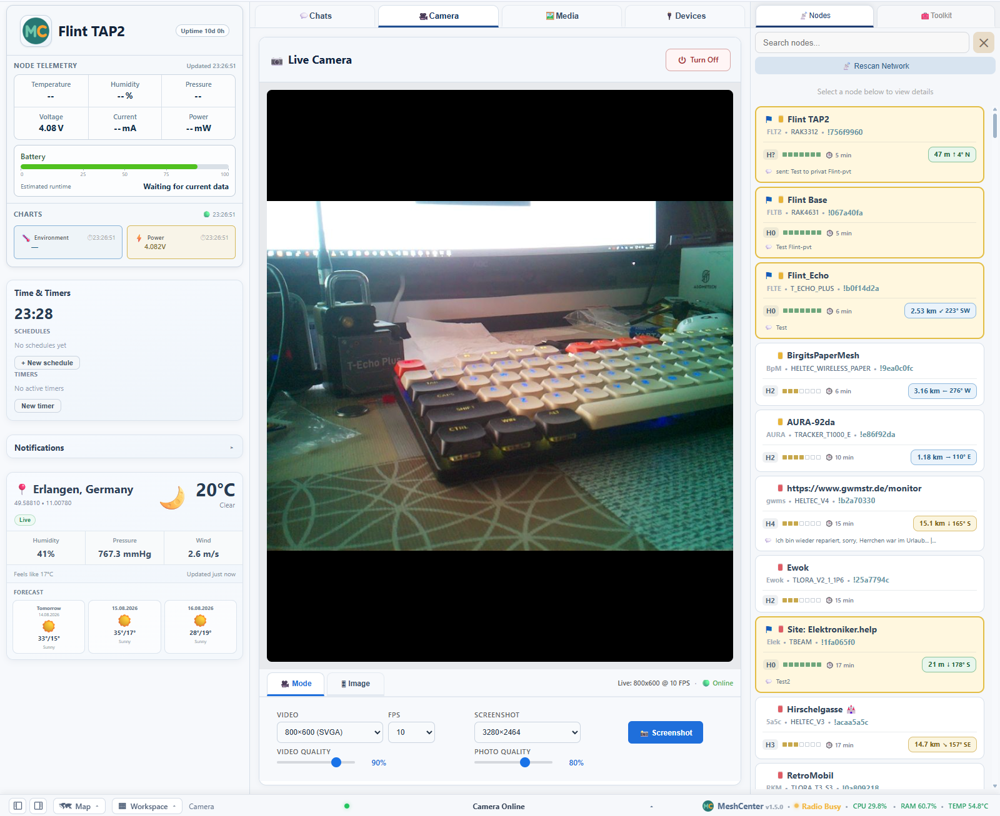

</details>

<details>
<summary>📟 Devices — Light theme</summary>

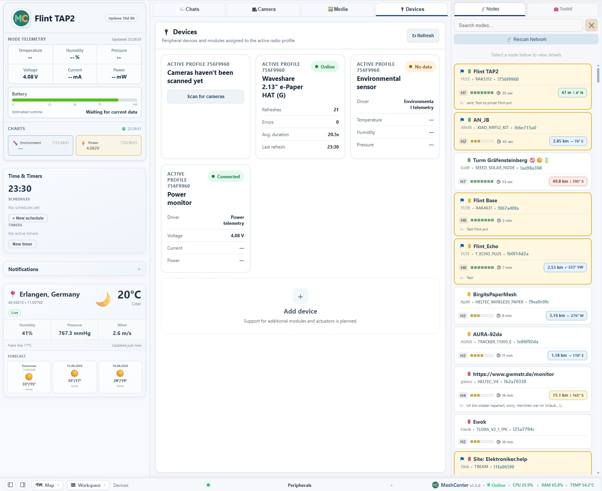

</details>

<details>
<summary>ℹ️ About — Dark theme</summary>

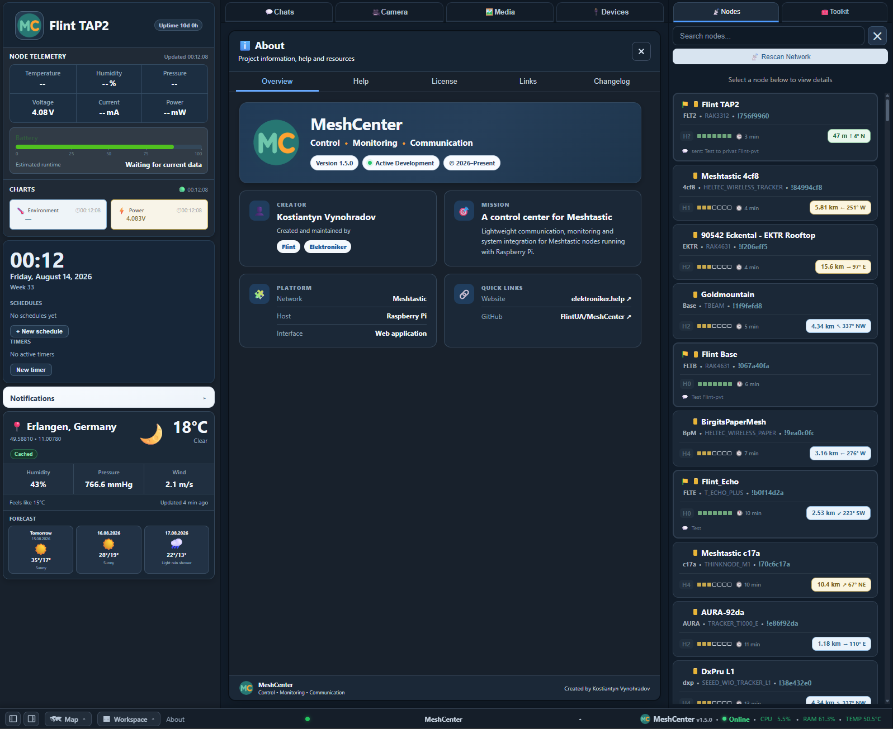

</details>

---

## ⚡ Quick Install

The fastest path is **Automatic Installation**:

1. Flash an SD card with Raspberry Pi Imager (Raspberry Pi OS Lite 64-bit). While you're in the imager's ⚙️ settings, set a hostname — it decides the `.local` address everything below uses. This guide says `meshcenter`, but if you name your Pi `MeshCenterTest`, you'll reach it at `http://meshcentertest.local` instead. Case doesn't matter: hostnames are case-insensitive, so lowercase always works no matter how you typed it.
2. Copy [`meshcenter-firstboot.sh`](https://github.com/FlintUA/MeshCenter/releases/latest/download/meshcenter-firstboot.sh) to the **root** of the bootfs drive.
3. Open the `user-data` file on the bootfs drive (it already exists after flashing) and add this at the end:
   ```yaml
   runcmd:
     - [ bash, -lc, 'if [ -f /boot/firmware/meshcenter-firstboot.sh ]; then bash /boot/firmware/meshcenter-firstboot.sh; elif [ -f /boot/meshcenter-firstboot.sh ]; then bash /boot/meshcenter-firstboot.sh; fi' ]
   ```
   If `runcmd:` already exists in the file, add only the `- [ bash, ... ]` line under it. **This step is required** — without it the script just sits on the SD card and never runs.
4. Connect your Meshtastic radio via USB **before** first boot.
5. Power on. MeshCenter installs itself unattended (~5-20 min depending on hardware and whether camera support is requested). While it installs, open `http://meshcenter.local` (port 80) to watch a live step-by-step progress page. Once installation finishes and the Pi reboots, MeshCenter itself is reachable at `http://meshcenter.local:5000`.

Prefer to install over SSH on an already-running Pi (or any Debian/Ubuntu Linux box) instead? That's **Manual Installation** — `curl -sSL https://raw.githubusercontent.com/FlintUA/MeshCenter/main/install.sh | bash`.

Full step-by-step instructions for both paths, system requirements, and the serial-access checklist that trips up most first installs: see **[INSTALL.md](INSTALL.md)**.

The install has been validated end-to-end on a clean Raspberry Pi Zero 2 W with a RAK WisMesh TAP v2 (RAK3312), installing entirely from the documentation with no undocumented steps. Also works on Raspberry Pi 3, 4 and 5.

---

## Features

- **Messaging** — public channel and direct messages, native Meshtastic reply support, favorites/ignore list, full chat history
- **Files (MCAttach)** — end-to-end encrypted node-to-node file transfer with a pluggable Relay, trusted-contact key exchange, and transfer lifecycle tracking
- **Interactive Map** — embedded Leaflet map with live node positions, distance/bearing, waypoint management, synchronized selection with the node list
- **Node Management** — automatic discovery, hardware/role info, favorites, custom icons, CSV/JSON export-import, remote Node Tools (telemetry/position request, traceroute)
- **Telemetry** — device/environment/power history with selectable chart ranges, bounded and debounced storage (see [Data Storage](docs/architecture/Architecture.md#data-storage))
- **Camera** — live MJPEG streaming and photo capture, Raspberry Pi Camera (CSI) and USB/UVC webcam support side by side
- **System & Radio Health** — CPU/RAM/disk/temperature, radio listener status, automatic listener recovery, a system log
- **Weather** — current conditions and forecast from a pluggable provider (OpenWeather or WeatherAPI)
- **Wi-Fi Manager** — scan, connect, forget networks from the browser
- **Automation** — a schedule engine (timed/interval-based mesh actions and data reports), stopwatch/countdown timers, and a notification center
- **Optional hardware** — an e-Paper display (Waveshare 2.13" color or WeAct 1.54" B/W) for headless status, and I2C sensors (BME280) / a real-time clock (DS3231)
- **Multi-radio profiles** — switch between physical radios with each one's data kept isolated
- **Localization** — English, German, Russian and Ukrainian interface language, with the Files workspace fully translated in all four (see [docs/User_Guide.md](docs/User_Guide.md#language) for current coverage of the rest)

See **[docs/User_Guide.md](docs/User_Guide.md)** for the full, practical walkthrough of every feature above — installation, configuration, day-to-day usage, backup, and troubleshooting. See [docs/architecture/Architecture.md](docs/architecture/Architecture.md) for how it's built internally, and [docs/development/Roadmap.md](docs/development/Roadmap.md) for what's planned.

---

## Radio connection

MeshCenter can talk to your Meshtastic node three ways, switchable in **Settings → Radio Connection**:

- **USB** (default, recommended) — a serial cable to the Raspberry Pi. Full send and receive.
- **TCP** — over the local network, if your radio exposes Meshtastic's TCP API. Full send and receive, but no delivery acknowledgements and no remote waypoint deletion.
- **Bluetooth** (marked "Experimental") — no incoming messages/telemetry/node-info at all while active (send-only); switching connection types can take up to ~90–135 seconds in the worst case.

See [docs/User_Guide.md](docs/User_Guide.md#12-radio-connection-type) for the full detail, and [Switching to another radio](docs/User_Guide.md#working-with-multiple-radios) for moving to a different physical device — each radio keeps its own, isolated data (messages, nodes, telemetry, waypoints).

---

## Tested Hardware

MeshCenter is primarily developed and tested on a Raspberry Pi Zero 2 W, with a Raspberry Pi 4B also in regular use. Radios actually used for development and testing:

- **RAK4631** (USB serial)
- **RAK WisMesh TAP v2 / RAK3312** (USB serial) — also the install-validation reference device above
- **A T-Beam, connected over TCP** rather than USB serial

Cameras: a Raspberry Pi Camera (IMX219/OV5647, CSI) and a **Microsoft USB3.0 HD camera** (USB/UVC, YUYV-only — MJPEG passthrough is implemented and unit-tested but has not been separately live-verified against an MJPEG-capable USB camera). Also used: an INA226 power monitor, a BME280 environmental sensor, a DS3231 real-time clock, and a WeAct 1.54" e-Paper display.

Other Raspberry Pi models and standard Meshtastic-compatible radios with a supported USB serial, TCP, or Bluetooth connection are expected to work, though not all have been specifically verified. The radio must already be configured with an official Meshtastic application — MeshCenter uses whatever region, channels and keys are already on it, and does not modify the radio's own configuration.

**Enable Serial access before connecting a radio by USB**: in the official Meshtastic app, `Settings → Security → Serial enabled` (some firmware versions show it under `Settings → Device` instead — don't confuse it with the separate "Serial module"). If this is off, Linux may still create `/dev/ttyACM0` while MeshCenter can't actually read the radio's identity — the most common cause of "radio not detected."

---

## Outbound network use

MeshCenter's core functionality (messaging, camera, telemetry, node management) needs no internet access at all. A few *optional* features do reach outside the local network when enabled: weather data (from the configured provider), OpenStreetMap map tiles, a once-a-day GitHub Releases check for updates, and MCAttach's Relay for file transfers that need one (the project hosts a default Relay instance; self-hosting is supported — see [`relay-server/`](relay-server/README.md)). None of these are required for day-to-day operation.

---

## Security

A setup wizard requires a password (at least 12 characters) before the interface is usable at all; every page and `/api/` request is then session-authenticated. Changing the password immediately logs out every *other* open session. Every state-changing `/api/` request requires a CSRF token. Repeated failed logins are throttled.

MeshCenter is served over plain HTTP by default and is intended for a trusted local network — password protection stops unauthorized use of the interface, but doesn't encrypt the connection itself. Use a VPN or a TLS-terminating reverse proxy for genuine remote access rather than exposing the service directly to the Internet.

See [docs/User_Guide.md](docs/User_Guide.md#18-security-notes) for the full detail.

---

## REST API

MeshCenter's browser interface talks to itself over a REST API — primarily for internal use, though it can be used for simple third-party integrations on the same trusted network. See **[docs/API_ROUTES.md](docs/API_ROUTES.md)** for the complete, auto-generated list of every route (regenerated from the code, never hand-maintained — CI fails if it drifts), and [docs/BACKEND_API.md](docs/BACKEND_API.md) for hand-written protocol documentation of the internal radio-adapter IPC layer.

---

## Known Limitations

| # | Description | Status |
|---|---|---|
| KI-001b | A WeAct 1.54" e-Paper panel can stop showing visible updates despite the protocol completing correctly | Open, hardware-specific |
| KI-002 | The Meshtastic Python API (2.7.x) does not support reading a node's current time | Waiting on upstream |
| KI-003 | The field picker UI for the "Send data report" schedule action is still basic | Planned |
| KI-007 | Chat-list timestamps are formatted server-side and don't react to the 12h/24h toggle | Planned |

Full history and root-cause details for these and other issues: see [KNOWN_ISSUES.md](KNOWN_ISSUES.md). See also the Radio Connection limitations above (TCP's narrower receive scope, Bluetooth's send-only behavior) and [docs/User_Guide.md's Troubleshooting section](docs/User_Guide.md#17-troubleshooting).

---

## Frequently Asked Questions

### Does MeshCenter support mobile devices?

MeshCenter is currently optimized for desktop web browsers. It's partially usable on many tablets; full mobile optimization is a planned future improvement.

### Does MeshCenter replace the official Meshtastic application?

No. MeshCenter complements the official applications with a permanent browser-based control center for Raspberry Pi installations; radio configuration itself is still done with the official app.

### Does MeshCenter send photos over Meshtastic?

No. Photos are stored locally on the Raspberry Pi and viewed through the web interface.

### Can multiple browsers connect simultaneously?

Yes — multiple users on the same local network can use the interface at the same time.

### Does MeshCenter require Internet access?

No, not for core functionality — see [Outbound network use](#outbound-network-use) above for the specific optional features that do.

### Which Raspberry Pi models are supported?

Raspberry Pi Zero 2W (the primary target), 3, 4 and 5.

---

## Roadmap

See **[docs/development/Roadmap.md](docs/development/Roadmap.md)** for current and planned work. The project's own direction is conservative: features are added once tested and integrated without compromising stability, with an ongoing push to keep shrinking `server.py` by moving logic into focused modules.

## Version History

| Version | Highlights |
|----------|------------|
| v1.8.4 | MCAttach control-channel index fix; production logging (`wsgi.py`); Relay server source published under `relay-server/` for optional self-hosting; a guided "Connect a Relay" setup wizard; transfer detail card with Normal/Advanced/Technical levels |
| v1.8.2 | Documentation maintenance: `STYLE_GUIDE.md` brought up to date with the theme-registry work |
| v1.8.1 | Installation ID (`PRIVACY.md`) with a management CLI; unified `.btn` sizing system; identity-check failures routed to the System Log instead of raw exception text |
| v1.8.0 | I2C device support (RTC + BME280), e-Paper display redesign with auto-rotation, stored-XSS fix, gunicorn in production |
| v1.7.0 | Auto-Installer (cloud-init), redesigned Time card, channel name/discovery fixes |
| v1.6.0 | Time System, Notifications & Automation — Schedule Engine, Timers, Notification Center |
| v1.5.0 | Localization (i18n) foundation & reliability fixes |
| v1.4.0 | Multi-Radio Profiles & Node Manager |
| v1.3.0 | Waypoints, Notifications, Action Engine |
| v1.2.0 | Interactive Map |
| v1.1.0 | Redesigned node inspector with a tabbed interface |
| v1.0.1 | Early production-readiness fixes: config validation, port-release handling, `sensors.json` robustness |
| v1.0.0 | First Stable Release |

A substantial batch of security, storage-reliability, telemetry and TCP-transport work has landed on `main` since v1.8.4 and is pending its own release tag — see the [GitHub Releases page](https://github.com/FlintUA/MeshCenter/releases) for the authoritative, up-to-date list, and recent commits/PRs for anything not yet tagged.

---

## Contributing

Contributions are welcome — open an Issue or Pull Request for bugs, improvements, or documentation fixes.

Before opening a Pull Request, install `requirements-dev.txt` and run `pytest` from the repo root - it's quick and catches regressions in the areas it covers (CLI-output parsing, settings normalization, node ID validation, auth, storage, telemetry, and more - see `tests/`). GitHub Actions CI runs the same suite plus several static checks (byte-compilation, shell/JS syntax, the GPLv3 license boundary, i18n catalog consistency, cache-busting, and API documentation staleness) on every PR and push to `main`.

### Reporting Issues

Please include: Raspberry Pi model and OS version, Python version, Meshtastic firmware/CLI version, browser, relevant log messages, and steps to reproduce.

---

## Acknowledgements

Special thanks to the Meshtastic Team, the Raspberry Pi Foundation, the open-source community, and everyone who tests MeshCenter and shares feedback.

## Support

If you enjoy the project: ⭐ star the repository, report bugs, suggest features, or share it with other Meshtastic users.

## Author

**Kostiantyn Vynohradov (FlintUA)** — Electronics engineer, embedded systems enthusiast and Meshtastic hobbyist.

- Live Demo: https://meshcenter.elektroniker.help/preview/
- Information Center: https://meshcenter.elektroniker.help/
- GitHub: [https://github.com/FlintUA](https://github.com/FlintUA)
- Project repository: [https://github.com/FlintUA/MeshCenter](https://github.com/FlintUA/MeshCenter)
- Website: [https://elektroniker.help](https://elektroniker.help) — additional articles and projects on Meshtastic, Raspberry Pi, embedded systems, electronics and 3D printing

## Disclaimer

MeshCenter is an independent open-source project created for the Meshtastic community. It is not affiliated with or endorsed by the official Meshtastic project. Meshtastic® is a trademark of its respective owners.

---

<p align="center">
Made with ❤️ for the Meshtastic community
</p>
